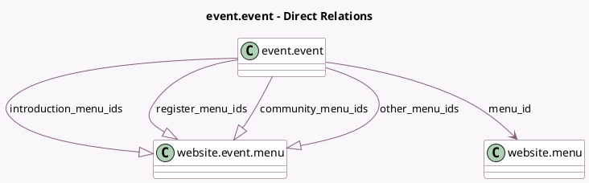

<!-- GENERATED:MODEL -->
---
tags: [odoo, community, generated, model]
---

# event.event

- Module: [[docs/Community Addons/website_event/website_event|website_event]]
- Scope: Community Addons
- Defined in module: yes
- Source files: `models/event_event.py`
- Python classes: `EventEvent`
- Inherits: `website.cover_properties.mixin`, `website.page_visibility_options.mixin`, `website.published.multi.mixin`, `website.searchable.mixin`, `website.seo.metadata`

## Field footprint

- Detected fields: 20
- Field types: `Boolean` x 10, `Char` x 3, `Integer` x 1, `Many2one` x 1, `One2many` x 4, `Selection` x 1
- Relation fields: 5

## Sample fields

- `address_name`: `Char` (related `address_id.name`)
- `community_menu`: `Boolean` (comodel `Community Menu`, compute `_compute_community_menu`, store `True`)
- `community_menu_ids`: `One2many` (comodel `website.event.menu`)
- `event_register_url`: `Char` (comodel `Event Registration Link`, compute `_compute_event_register_url`)
- `introduction_menu`: `Boolean` (comodel `Introduction Menu`, compute `_compute_website_menu_data`, store `True`)
- `introduction_menu_ids`: `One2many` (comodel `website.event.menu`)
- `is_done`: `Boolean` (comodel `Is Done`, compute `_compute_time_data`)
- `is_ongoing`: `Boolean` (comodel `Is Ongoing`, compute `_compute_time_data`)
- `is_participating`: `Boolean` (comodel `Is Participating`, compute `_compute_is_participating`)
- `is_visible_on_website`: `Boolean` (compute `_compute_is_visible_on_website`)
- `menu_id`: `Many2one` (comodel `website.menu`)
- `other_menu_ids`: `One2many` (comodel `website.event.menu`)
- `register_menu`: `Boolean` (comodel `Register Menu`, compute `_compute_website_menu_data`, store `True`)
- `register_menu_ids`: `One2many` (comodel `website.event.menu`)
- `start_remaining`: `Integer` (comodel `Remaining before start`, compute `_compute_time_data`)
- `start_today`: `Boolean` (comodel `Start Today`, compute `_compute_time_data`)
- `subtitle`: `Char` (comodel `Event Subtitle`)
- `website_menu`: `Boolean` (compute `_compute_website_menu`, store `True`)
- `website_published`: `Boolean`
- `website_visibility`: `Selection`

## Method hints

- Detected methods: 36
- Action methods: none
- Compute methods: `_compute_community_menu`, `_compute_event_register_url`, `_compute_event_share_url`, `_compute_is_participating`, `_compute_is_visible_on_website`, `_compute_time_data`, `_compute_website_menu`, `_compute_website_menu_data`, and 1 more
- Onchange methods: none

## Direct relation diagram

## Navigation

- **Parent:** [[docs/Community Addons/website_event/Models]]

<!-- GENERATED:MODEL -->
