<!-- GENERATED:MODEL -->
---
tags: [odoo, community, generated, model]
---

# website.event.menu

- Module: [[docs/Community Addons/website_event/website_event|website_event]]
- Scope: Community Addons
- Defined in module: yes
- Source files: `models/website_event_menu.py`
- Python classes: `WebsiteEventMenu`
- Description: Website Event Menu
- Inherits: `website.seo.metadata`

## Field footprint

- Detected fields: 4
- Field types: `Many2one` x 3, `Selection` x 1
- Relation fields: 3

## Sample fields

- `event_id`: `Many2one` (comodel `event.event`)
- `menu_id`: `Many2one` (comodel `website.menu`)
- `menu_type`: `Selection`
- `view_id`: `Many2one` (comodel `ir.ui.view`)

## Method hints

- Detected methods: 3
- Action methods: none
- Compute methods: none
- Onchange methods: none

## Direct relation diagram

```plantuml
@startuml
!define ODOO_COLOR_PRIMARY #714B67
!define ODOO_COLOR_ACCENT #875A7B
!define ODOO_COLOR_BG #FAF7FA

skinparam backgroundColor ODOO_COLOR_BG
skinparam defaultTextAlignment left
skinparam ArrowColor ODOO_COLOR_ACCENT
skinparam ClassBackgroundColor white
skinparam ClassBorderColor ODOO_COLOR_PRIMARY
skinparam ComponentBackgroundColor white
skinparam ComponentBorderColor ODOO_COLOR_PRIMARY
skinparam NoteBackgroundColor #FFF8FF
skinparam NoteBorderColor ODOO_COLOR_ACCENT
skinparam SequenceLifeLineBorderColor ODOO_COLOR_ACCENT
skinparam SequenceLifeLineBackgroundColor #FFFFFF
skinparam SequenceParticipantBorderColor ODOO_COLOR_PRIMARY
skinparam SequenceParticipantBackgroundColor #FFFFFF
skinparam sequence {
  ArrowColor ODOO_COLOR_ACCENT
  ActorBorderColor ODOO_COLOR_PRIMARY
}
title website.event.menu - Direct Relations
class "website.event.menu" as website_event_menu
class "event.event" as event_event
class "ir.ui.view" as ir_ui_view
class "website.menu" as website_menu
website_event_menu --> website_menu : menu_id
website_event_menu --> event_event : event_id
website_event_menu --> ir_ui_view : view_id
@enduml
```

## Navigation

- **Parent:** [[docs/Community Addons/website_event/Models]]

<!-- GENERATED:MODEL -->
