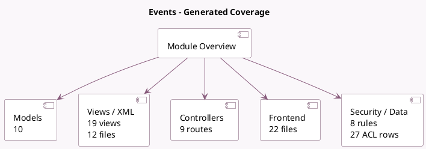

<!-- GENERATED:MODULE -->
---
tags: [odoo, community, module]
---

# Events

- Scope: Community Addons
- Source: odoo/addons/website_event
- Dependencies: [[docs/Community Addons/event/event|event]], [[docs/Community Addons/website/website|website]], [[docs/Community Addons/website_partner/website_partner|website_partner]], [[docs/Community Addons/website_mail/website_mail|website_mail]], [[docs/Community Addons/html_builder/html_builder|html_builder]]

## Summary

Publish events, sell tickets

## Generated coverage

- Models: 10
- XML files with UI/data artifacts: 12
- Views: 19
- Actions: 6
- Menus: 2
- Rules (ir.rule): 8
- Access CSV entries: 27
- Controller units: 2
- Frontend asset files: 22

## Module map

## Detail notes

- Models: [[docs/Community Addons/website_event/Models|Models]] (10)
- Views and XML: [[docs/Community Addons/website_event/Views|Views]] (12 files)
- Controllers: [[docs/Community Addons/website_event/Controllers|Controllers]] (2)
- Frontend: [[docs/Community Addons/website_event/Frontend|Frontend]] (22 files)

## Key models

- `event.event`
- `event.registration`
- `event.tag`
- `event.tag.category`
- `event.type`
- `website`
- `website.event.menu`
- `website.menu`
- `website.snippet.filter`
- `website.visitor`

## Navigation

- [[../Community Addons/Community Addons|Back to scope]]
- [[../../docs/docs|Back to docs]]

<!-- GENERATED:MODULE -->

