<!-- GENERATED:MODEL -->
---
tags: [odoo, community, generated, model]
---

# event.event

- Module: [[docs/Community Addons/website_event_booth/website_event_booth|website_event_booth]]
- Scope: Community Addons
- Defined in module: extension only
- Source files: `models/event_event.py`
- Python classes: `EventEvent`

## Field footprint

- Detected fields: 3
- Field types: `Boolean` x 1, `Image` x 1, `One2many` x 1
- Relation fields: 1

## Sample fields

- `booth_menu`: `Boolean` (compute `_compute_booth_menu`, store `True`)
- `booth_menu_ids`: `One2many` (comodel `website.event.menu`)
- `exhibition_map`: `Image`

## Method hints

- Detected methods: 7
- Action methods: none
- Compute methods: `_compute_booth_menu`
- Onchange methods: none

## Direct relation diagram

```plantuml
@startuml
!define ODOO_COLOR_PRIMARY #714B67
!define ODOO_COLOR_ACCENT #875A7B
!define ODOO_COLOR_BG #FAF7FA

skinparam backgroundColor ODOO_COLOR_BG
skinparam defaultTextAlignment left
skinparam ArrowColor ODOO_COLOR_ACCENT
skinparam ClassBackgroundColor white
skinparam ClassBorderColor ODOO_COLOR_PRIMARY
skinparam ComponentBackgroundColor white
skinparam ComponentBorderColor ODOO_COLOR_PRIMARY
skinparam NoteBackgroundColor #FFF8FF
skinparam NoteBorderColor ODOO_COLOR_ACCENT
skinparam SequenceLifeLineBorderColor ODOO_COLOR_ACCENT
skinparam SequenceLifeLineBackgroundColor #FFFFFF
skinparam SequenceParticipantBorderColor ODOO_COLOR_PRIMARY
skinparam SequenceParticipantBackgroundColor #FFFFFF
skinparam sequence {
  ArrowColor ODOO_COLOR_ACCENT
  ActorBorderColor ODOO_COLOR_PRIMARY
}
title event.event - Direct Relations
class "event.event" as event_event
class "website.event.menu" as website_event_menu
event_event --|> website_event_menu : booth_menu_ids
@enduml
```

## Navigation

- **Parent:** [[docs/Community Addons/website_event_booth/Models]]

<!-- GENERATED:MODEL -->
