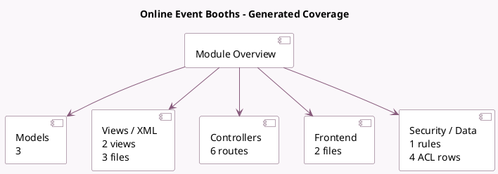

<!-- GENERATED:MODULE -->
---
tags: [odoo, community, module]
---

# Online Event Booths

- Scope: Community Addons
- Source: odoo/addons/website_event_booth
- Dependencies: [[docs/Community Addons/website_event/website_event|website_event]], [[docs/Community Addons/event_booth/event_booth|event_booth]]

## Summary

Events, display your booths on your website

## Generated coverage

- Models: 3
- XML files with UI/data artifacts: 3
- Views: 2
- Actions: 0
- Menus: 0
- Rules (ir.rule): 1
- Access CSV entries: 4
- Controller units: 1
- Frontend asset files: 2

## Module map

## Detail notes

- Models: [[docs/Community Addons/website_event_booth/Models|Models]] (3)
- Views and XML: [[docs/Community Addons/website_event_booth/Views|Views]] (3 files)
- Controllers: [[docs/Community Addons/website_event_booth/Controllers|Controllers]] (1)
- Frontend: [[docs/Community Addons/website_event_booth/Frontend|Frontend]] (2 files)

## Key models

- `event.event`
- `event.type`
- `website.event.menu`

## Navigation

- [[../Community Addons/Community Addons|Back to scope]]
- [[../../docs/docs|Back to docs]]

<!-- GENERATED:MODULE -->

