<!-- GENERATED:MODEL -->
---
tags: [odoo, community, generated, model]
---

# event.booth.category

- Module: [[docs/Community Addons/website_event_booth_exhibitor/website_event_booth_exhibitor|website_event_booth_exhibitor]]
- Scope: Community Addons
- Defined in module: extension only
- Source files: `models/event_booth_category.py`
- Python classes: `EventBoothCategory`

## Field footprint

- Detected fields: 3
- Field types: `Boolean` x 1, `Many2one` x 1, `Selection` x 1
- Relation fields: 1

## Sample fields

- `exhibitor_type`: `Selection`
- `sponsor_type_id`: `Many2one` (comodel `event.sponsor.type`)
- `use_sponsor`: `Boolean`

## Method hints

- Detected methods: 2
- Action methods: none
- Compute methods: none
- Onchange methods: `_onchange_use_sponsor`

## Direct relation diagram

```plantuml
@startuml
!define ODOO_COLOR_PRIMARY #714B67
!define ODOO_COLOR_ACCENT #875A7B
!define ODOO_COLOR_BG #FAF7FA

skinparam backgroundColor ODOO_COLOR_BG
skinparam defaultTextAlignment left
skinparam ArrowColor ODOO_COLOR_ACCENT
skinparam ClassBackgroundColor white
skinparam ClassBorderColor ODOO_COLOR_PRIMARY
skinparam ComponentBackgroundColor white
skinparam ComponentBorderColor ODOO_COLOR_PRIMARY
skinparam NoteBackgroundColor #FFF8FF
skinparam NoteBorderColor ODOO_COLOR_ACCENT
skinparam SequenceLifeLineBorderColor ODOO_COLOR_ACCENT
skinparam SequenceLifeLineBackgroundColor #FFFFFF
skinparam SequenceParticipantBorderColor ODOO_COLOR_PRIMARY
skinparam SequenceParticipantBackgroundColor #FFFFFF
skinparam sequence {
  ArrowColor ODOO_COLOR_ACCENT
  ActorBorderColor ODOO_COLOR_PRIMARY
}
title event.booth.category - Direct Relations
class "event.booth.category" as event_booth_category
class "event.sponsor.type" as event_sponsor_type
event_booth_category --> event_sponsor_type : sponsor_type_id
@enduml
```

## Navigation

- **Parent:** [[docs/Community Addons/website_event_booth_exhibitor/Models]]

<!-- GENERATED:MODEL -->
