<!-- GENERATED:MODEL -->
---
tags: [odoo, community, generated, model]
---

# event.booth

- Module: [[docs/Community Addons/website_event_booth_exhibitor/website_event_booth_exhibitor|website_event_booth_exhibitor]]
- Scope: Community Addons
- Defined in module: extension only
- Source files: `models/event_booth.py`
- Python classes: `EventBooth`

## Field footprint

- Detected fields: 9
- Field types: `Boolean` x 1, `Char` x 4, `Html` x 1, `Image` x 1, `Many2one` x 2
- Relation fields: 2

## Sample fields

- `sponsor_email`: `Char` (related `sponsor_id.email`)
- `sponsor_id`: `Many2one` (comodel `event.sponsor`)
- `sponsor_image_512`: `Image` (related `sponsor_id.image_512`)
- `sponsor_name`: `Char` (related `sponsor_id.name`)
- `sponsor_phone`: `Char` (related `sponsor_id.phone`)
- `sponsor_subtitle`: `Char` (related `sponsor_id.subtitle`)
- `sponsor_type_id`: `Many2one` (related `booth_category_id.sponsor_type_id`)
- `sponsor_website_description`: `Html` (related `sponsor_id.website_description`)
- `use_sponsor`: `Boolean` (related `booth_category_id.use_sponsor`)

## Method hints

- Detected methods: 3
- Action methods: `action_view_sponsor`
- Compute methods: none
- Onchange methods: none

## Direct relation diagram

```plantuml
@startuml
!define ODOO_COLOR_PRIMARY #714B67
!define ODOO_COLOR_ACCENT #875A7B
!define ODOO_COLOR_BG #FAF7FA

skinparam backgroundColor ODOO_COLOR_BG
skinparam defaultTextAlignment left
skinparam ArrowColor ODOO_COLOR_ACCENT
skinparam ClassBackgroundColor white
skinparam ClassBorderColor ODOO_COLOR_PRIMARY
skinparam ComponentBackgroundColor white
skinparam ComponentBorderColor ODOO_COLOR_PRIMARY
skinparam NoteBackgroundColor #FFF8FF
skinparam NoteBorderColor ODOO_COLOR_ACCENT
skinparam SequenceLifeLineBorderColor ODOO_COLOR_ACCENT
skinparam SequenceLifeLineBackgroundColor #FFFFFF
skinparam SequenceParticipantBorderColor ODOO_COLOR_PRIMARY
skinparam SequenceParticipantBackgroundColor #FFFFFF
skinparam sequence {
  ArrowColor ODOO_COLOR_ACCENT
  ActorBorderColor ODOO_COLOR_PRIMARY
}
title event.booth - Direct Relations
class "event.booth" as event_booth
class "event.sponsor" as event_sponsor
event_booth --> event_sponsor : sponsor_id
@enduml
```

## Navigation

- **Parent:** [[docs/Community Addons/website_event_booth_exhibitor/Models]]

<!-- GENERATED:MODEL -->
