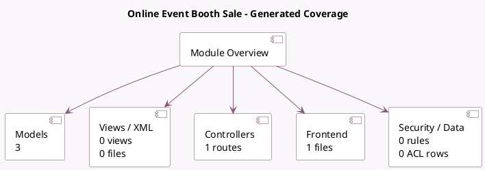

<!-- GENERATED:MODULE -->
---
tags: [odoo, community, module]
---

# Online Event Booth Sale

- Scope: Community Addons
- Source: odoo/addons/website_event_booth_sale
- Dependencies: [[docs/Community Addons/event_booth_sale/event_booth_sale|event_booth_sale]], [[docs/Community Addons/website_event_booth/website_event_booth|website_event_booth]], [[docs/Community Addons/website_sale/website_sale|website_sale]]

## Summary

Events, sell your booths online

## Generated coverage

- Models: 3
- XML files with UI/data artifacts: 0
- Views: 0
- Actions: 0
- Menus: 0
- Rules (ir.rule): 0
- Access CSV entries: 0
- Controller units: 1
- Frontend asset files: 1

## Module map

## Detail notes

- Models: [[docs/Community Addons/website_event_booth_sale/Models|Models]] (3)
- Controllers: [[docs/Community Addons/website_event_booth_sale/Controllers|Controllers]] (1)
- Frontend: [[docs/Community Addons/website_event_booth_sale/Frontend|Frontend]] (1 files)

## Key models

- `product.template`
- `sale.order`
- `sale.order.line`

## Navigation

- [[../Community Addons/Community Addons|Back to scope]]
- [[../../docs/docs|Back to docs]]

<!-- GENERATED:MODULE -->

