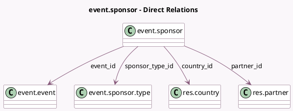

<!-- GENERATED:MODEL -->
---
tags: [odoo, community, generated, model]
---

# event.sponsor

- Module: [[docs/Community Addons/website_event_exhibitor/website_event_exhibitor|website_event_exhibitor]]
- Scope: Community Addons
- Defined in module: yes
- Source files: `models/event_sponsor.py`
- Python classes: `EventSponsor`
- Description: Event Sponsor
- Inherits: `mail.activity.mixin`, `mail.thread`, `website.published.mixin`, `website.searchable.mixin`

## Field footprint

- Detected fields: 26
- Field types: `Boolean` x 3, `Char` x 10, `Float` x 2, `Html` x 1, `Image` x 3, `Integer` x 1, `Many2one` x 4, `Selection` x 2
- Relation fields: 4

## Sample fields

- `active`: `Boolean`
- `country_flag_url`: `Char` (compute `_compute_country_flag_url`)
- `country_id`: `Many2one` (comodel `res.country`, related `partner_id.country_id`)
- `email`: `Char` (comodel `Sponsor Email`, compute `_compute_email`, store `True`)
- `event_date_tz`: `Selection` (related `event_id.date_tz`)
- `event_id`: `Many2one` (comodel `event.event`)
- `exhibitor_type`: `Selection`
- `hour_from`: `Float` (comodel `Opening hour`)
- `hour_to`: `Float` (comodel `End hour`)
- `image_128`: `Image` (comodel `Image 128`, related `image_512`, store `False`)
- `image_256`: `Image` (comodel `Image 256`, related `image_512`, store `False`)
- `image_512`: `Image` (compute `_compute_image_512`, store `True`)
- `is_in_opening_hours`: `Boolean` (comodel `Within opening hours`, compute `_compute_is_in_opening_hours`)
- `name`: `Char` (comodel `Sponsor Name`, compute `_compute_name`, store `True`)
- `partner_email`: `Char` (comodel `Email`, related `partner_id.email`)
- `partner_id`: `Many2one` (comodel `res.partner`)
- `partner_name`: `Char` (comodel `Name`, related `partner_id.name`)
- `partner_phone`: `Char` (comodel `Phone`, related `partner_id.phone`)
- `phone`: `Char` (comodel `Sponsor Phone`, compute `_compute_phone`, store `True`)
- `sequence`: `Integer` (comodel `Sequence`)

## Method hints

- Detected methods: 16
- Action methods: none
- Compute methods: `_compute_country_flag_url`, `_compute_email`, `_compute_image_512`, `_compute_is_in_opening_hours`, `_compute_name`, `_compute_phone`, `_compute_url`, `_compute_website_absolute_url`, and 3 more
- Onchange methods: none

## Direct relation diagram

## Navigation

- **Parent:** [[docs/Community Addons/website_event_exhibitor/Models]]

<!-- GENERATED:MODEL -->
