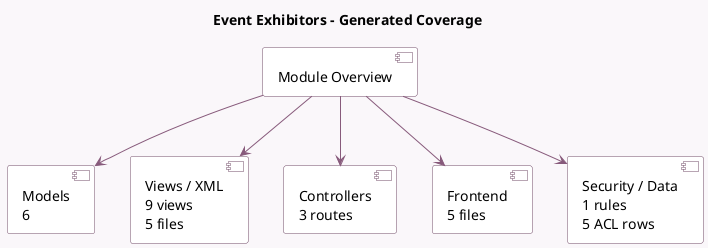

<!-- GENERATED:MODULE -->
---
tags: [odoo, community, module]
---

# Event Exhibitors

- Scope: Community Addons
- Source: odoo/addons/website_event_exhibitor
- Dependencies: [[docs/Community Addons/website_event/website_event|website_event]]

## Summary

Event: manage sponsors and exhibitors

## Generated coverage

- Models: 6
- XML files with UI/data artifacts: 5
- Views: 9
- Actions: 3
- Menus: 1
- Rules (ir.rule): 1
- Access CSV entries: 5
- Controller units: 1
- Frontend asset files: 5

## Module map

## Detail notes

- Models: [[docs/Community Addons/website_event_exhibitor/Models|Models]] (6)
- Views and XML: [[docs/Community Addons/website_event_exhibitor/Views|Views]] (5 files)
- Controllers: [[docs/Community Addons/website_event_exhibitor/Controllers|Controllers]] (1)
- Frontend: [[docs/Community Addons/website_event_exhibitor/Frontend|Frontend]] (5 files)

## Key models

- `event.event`
- `event.sponsor`
- `event.sponsor.type`
- `event.type`
- `website`
- `website.event.menu`

## Navigation

- [[../Community Addons/Community Addons|Back to scope]]
- [[../../docs/docs|Back to docs]]

<!-- GENERATED:MODULE -->

