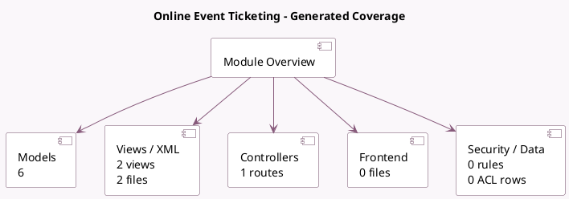

<!-- GENERATED:MODULE -->
---
tags: [odoo, community, module]
---

# Online Event Ticketing

- Scope: Community Addons
- Source: odoo/addons/website_event_sale
- Dependencies: [[docs/Community Addons/website_event/website_event|website_event]], [[docs/Community Addons/event_sale/event_sale|event_sale]], [[docs/Community Addons/website_sale/website_sale|website_sale]]

## Summary

Sell event tickets online

## Generated coverage

- Models: 6
- XML files with UI/data artifacts: 2
- Views: 2
- Actions: 0
- Menus: 0
- Rules (ir.rule): 0
- Access CSV entries: 0
- Controller units: 1
- Frontend asset files: 0

## Module map

## Detail notes

- Models: [[docs/Community Addons/website_event_sale/Models|Models]] (6)
- Views and XML: [[docs/Community Addons/website_event_sale/Views|Views]] (2 files)
- Controllers: [[docs/Community Addons/website_event_sale/Controllers|Controllers]] (1)

## Key models

- `event.sale.report`
- `product.pricelist.item`
- `product.product`
- `product.template`
- `sale.order`
- `sale.order.line`

## Navigation

- [[../Community Addons/Community Addons|Back to scope]]
- [[../../docs/docs|Back to docs]]

<!-- GENERATED:MODULE -->

