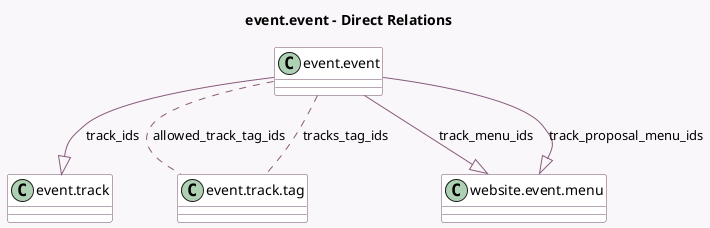

<!-- GENERATED:MODEL -->
---
tags: [odoo, community, generated, model]
---

# event.event

- Module: [[docs/Community Addons/website_event_track/website_event_track|website_event_track]]
- Scope: Community Addons
- Defined in module: extension only
- Source files: `models/event_event.py`
- Python classes: `EventEvent`

## Field footprint

- Detected fields: 8
- Field types: `Boolean` x 2, `Integer` x 1, `Many2many` x 2, `One2many` x 3
- Relation fields: 5

## Sample fields

- `allowed_track_tag_ids`: `Many2many` (comodel `event.track.tag`)
- `track_count`: `Integer` (comodel `Track Count`, compute `_compute_track_count`)
- `track_ids`: `One2many` (comodel `event.track`)
- `track_menu_ids`: `One2many` (comodel `website.event.menu`)
- `track_proposal_menu_ids`: `One2many` (comodel `website.event.menu`)
- `tracks_tag_ids`: `Many2many` (comodel `event.track.tag`, compute `_compute_tracks_tag_ids`, store `True`)
- `website_track`: `Boolean` (comodel `Tracks on Website`, compute `_compute_website_track`, store `True`)
- `website_track_proposal`: `Boolean` (comodel `Proposals on Website`, compute `_compute_website_track_proposal`, store `True`)

## Method hints

- Detected methods: 12
- Action methods: none
- Compute methods: `_compute_track_count`, `_compute_tracks_tag_ids`, `_compute_website_track`, `_compute_website_track_proposal`
- Onchange methods: none

## Direct relation diagram

## Navigation

- **Parent:** [[docs/Community Addons/website_event_track/Models]]

<!-- GENERATED:MODEL -->
