<!-- GENERATED:MODEL -->
---
tags: [odoo, community, generated, model]
---

# event.track

- Module: [[docs/Community Addons/website_event_track/website_event_track|website_event_track]]
- Scope: Community Addons
- Defined in module: yes
- Source files: `models/event_track.py`
- Python classes: `EventTrack`
- Description: Event Track
- Inherits: `mail.activity.mixin`, `mail.thread`, `website.published.mixin`, `website.searchable.mixin`, `website.seo.metadata`

## Field footprint

- Detected fields: 53
- Field types: `Boolean` x 13, `Char` x 16, `Datetime` x 2, `Float` x 1, `Html` x 2, `Image` x 2, `Integer` x 6, `Many2many` x 2, `Many2one` x 6, `One2many` x 1, `Selection` x 2
- Relation fields: 9

## Sample fields

- `active`: `Boolean`
- `color`: `Integer` (comodel `Agenda Color`)
- `company_id`: `Many2one` (comodel `res.company`, related `event_id.company_id`)
- `contact_email`: `Char` (compute `_compute_contact_email`, store `True`)
- `contact_phone`: `Char` (compute `_compute_contact_phone`, store `True`)
- `date`: `Datetime` (comodel `Track Date`, compute `_compute_date`, store `True`)
- `date_end`: `Datetime` (comodel `Track End Date`, compute `_compute_end_date`, store `True`)
- `description`: `Html`
- `duration`: `Float` (comodel `Duration`)
- `event_id`: `Many2one` (comodel `event.event`)
- `event_track_visitor_ids`: `One2many` (comodel `event.track.visitor`)
- `footer_visible`: `Boolean` (related `event_id.footer_visible`)
- `header_visible`: `Boolean` (related `event_id.header_visible`)
- `image`: `Image` (compute `_compute_partner_image`, store `True`)
- `is_one_day`: `Boolean` (compute `_compute_field_is_one_day`)
- `is_reminder_on`: `Boolean` (comodel `Is Reminder On`, compute `_compute_is_reminder_on`)
- `is_track_done`: `Boolean` (comodel `Is Track Done`, compute `_compute_track_time_data`)
- `is_track_live`: `Boolean` (comodel `Is Track Live`, compute `_compute_track_time_data`)
- `is_track_soon`: `Boolean` (comodel `Is Track Soon`, compute `_compute_track_time_data`)
- `is_track_today`: `Boolean` (comodel `Is Track Today`, compute `_compute_track_time_data`)

## Method hints

- Detected methods: 42
- Action methods: none
- Compute methods: `_compute_contact_email`, `_compute_contact_phone`, `_compute_cta_time_data`, `_compute_date`, `_compute_end_date`, `_compute_field_is_one_day`, `_compute_is_reminder_on`, `_compute_kanban_state_label`, and 12 more
- Onchange methods: none

## Direct relation diagram

```plantuml
@startuml
!define ODOO_COLOR_PRIMARY #714B67
!define ODOO_COLOR_ACCENT #875A7B
!define ODOO_COLOR_BG #FAF7FA

skinparam backgroundColor ODOO_COLOR_BG
skinparam defaultTextAlignment left
skinparam ArrowColor ODOO_COLOR_ACCENT
skinparam ClassBackgroundColor white
skinparam ClassBorderColor ODOO_COLOR_PRIMARY
skinparam ComponentBackgroundColor white
skinparam ComponentBorderColor ODOO_COLOR_PRIMARY
skinparam NoteBackgroundColor #FFF8FF
skinparam NoteBorderColor ODOO_COLOR_ACCENT
skinparam SequenceLifeLineBorderColor ODOO_COLOR_ACCENT
skinparam SequenceLifeLineBackgroundColor #FFFFFF
skinparam SequenceParticipantBorderColor ODOO_COLOR_PRIMARY
skinparam SequenceParticipantBackgroundColor #FFFFFF
skinparam sequence {
  ArrowColor ODOO_COLOR_ACCENT
  ActorBorderColor ODOO_COLOR_PRIMARY
}
title event.track - Direct Relations
class "event.track" as event_track
class "event.event" as event_event
class "event.track.location" as event_track_location
class "event.track.stage" as event_track_stage
class "event.track.tag" as event_track_tag
class "event.track.visitor" as event_track_visitor
class "res.company" as res_company
class "res.partner" as res_partner
class "res.users" as res_users
class "website.visitor" as website_visitor
event_track --> event_event : event_id
event_track --> res_users : user_id
event_track --> res_company : company_id
event_track .. event_track_tag : tag_ids
event_track --> event_track_stage : stage_id
event_track --> res_partner : partner_id
event_track --> event_track_location : location_id
event_track --|> event_track_visitor : event_track_visitor_ids
event_track .. website_visitor : wishlist_visitor_ids
@enduml
```

## Navigation

- **Parent:** [[docs/Community Addons/website_event_track/Models]]

<!-- GENERATED:MODEL -->
