<!-- GENERATED:MODEL -->
---
tags: [odoo, community, generated, model]
---

# event.track.stage

- Module: [[docs/Community Addons/website_event_track/website_event_track|website_event_track]]
- Scope: Community Addons
- Defined in module: yes
- Source files: `models/event_track_stage.py`
- Python classes: `EventTrackStage`
- Description: Event Track Stage

## Field footprint

- Detected fields: 12
- Field types: `Boolean` x 4, `Char` x 4, `Integer` x 2, `Many2one` x 1, `Text` x 1
- Relation fields: 1

## Sample fields

- `color`: `Integer`
- `description`: `Text`
- `fold`: `Boolean`
- `is_cancel`: `Boolean`
- `is_fully_accessible`: `Boolean` (compute `_compute_is_fully_accessible`, store `True`)
- `is_visible_in_agenda`: `Boolean` (compute `_compute_is_visible_in_agenda`, store `True`)
- `legend_blocked`: `Char` (comodel `Red Kanban Label`)
- `legend_done`: `Char` (comodel `Green Kanban Label`)
- `legend_normal`: `Char` (comodel `Grey Kanban Label`)
- `mail_template_id`: `Many2one` (comodel `mail.template`)
- `name`: `Char`
- `sequence`: `Integer`

## Method hints

- Detected methods: 2
- Action methods: none
- Compute methods: `_compute_is_fully_accessible`, `_compute_is_visible_in_agenda`
- Onchange methods: none

## Direct relation diagram

```plantuml
@startuml
!define ODOO_COLOR_PRIMARY #714B67
!define ODOO_COLOR_ACCENT #875A7B
!define ODOO_COLOR_BG #FAF7FA

skinparam backgroundColor ODOO_COLOR_BG
skinparam defaultTextAlignment left
skinparam ArrowColor ODOO_COLOR_ACCENT
skinparam ClassBackgroundColor white
skinparam ClassBorderColor ODOO_COLOR_PRIMARY
skinparam ComponentBackgroundColor white
skinparam ComponentBorderColor ODOO_COLOR_PRIMARY
skinparam NoteBackgroundColor #FFF8FF
skinparam NoteBorderColor ODOO_COLOR_ACCENT
skinparam SequenceLifeLineBorderColor ODOO_COLOR_ACCENT
skinparam SequenceLifeLineBackgroundColor #FFFFFF
skinparam SequenceParticipantBorderColor ODOO_COLOR_PRIMARY
skinparam SequenceParticipantBackgroundColor #FFFFFF
skinparam sequence {
  ArrowColor ODOO_COLOR_ACCENT
  ActorBorderColor ODOO_COLOR_PRIMARY
}
title event.track.stage - Direct Relations
class "event.track.stage" as event_track_stage
class "mail.template" as mail_template
event_track_stage --> mail_template : mail_template_id
@enduml
```

## Navigation

- **Parent:** [[docs/Community Addons/website_event_track/Models]]

<!-- GENERATED:MODEL -->
