<!-- GENERATED:MODEL -->
---
tags: [odoo, community, generated, model]
---

# event.track.tag

- Module: [[docs/Community Addons/website_event_track/website_event_track|website_event_track]]
- Scope: Community Addons
- Defined in module: yes
- Source files: `models/event_track_tag.py`
- Python classes: `EventTrackTag`
- Description: Event Track Tag

## Field footprint

- Detected fields: 5
- Field types: `Char` x 1, `Integer` x 2, `Many2many` x 1, `Many2one` x 1
- Relation fields: 2

## Sample fields

- `category_id`: `Many2one` (comodel `event.track.tag.category`)
- `color`: `Integer`
- `name`: `Char` (comodel `Tag Name`)
- `sequence`: `Integer` (comodel `Sequence`)
- `track_ids`: `Many2many` (comodel `event.track`)

## Method hints

- Detected methods: 1
- Action methods: none
- Compute methods: none
- Onchange methods: none

## Direct relation diagram

```plantuml
@startuml
!define ODOO_COLOR_PRIMARY #714B67
!define ODOO_COLOR_ACCENT #875A7B
!define ODOO_COLOR_BG #FAF7FA

skinparam backgroundColor ODOO_COLOR_BG
skinparam defaultTextAlignment left
skinparam ArrowColor ODOO_COLOR_ACCENT
skinparam ClassBackgroundColor white
skinparam ClassBorderColor ODOO_COLOR_PRIMARY
skinparam ComponentBackgroundColor white
skinparam ComponentBorderColor ODOO_COLOR_PRIMARY
skinparam NoteBackgroundColor #FFF8FF
skinparam NoteBorderColor ODOO_COLOR_ACCENT
skinparam SequenceLifeLineBorderColor ODOO_COLOR_ACCENT
skinparam SequenceLifeLineBackgroundColor #FFFFFF
skinparam SequenceParticipantBorderColor ODOO_COLOR_PRIMARY
skinparam SequenceParticipantBackgroundColor #FFFFFF
skinparam sequence {
  ArrowColor ODOO_COLOR_ACCENT
  ActorBorderColor ODOO_COLOR_PRIMARY
}
title event.track.tag - Direct Relations
class "event.track.tag" as event_track_tag
class "event.track" as event_track
class "event.track.tag.category" as event_track_tag_category
event_track_tag .. event_track : track_ids
event_track_tag --> event_track_tag_category : category_id
@enduml
```

## Navigation

- **Parent:** [[docs/Community Addons/website_event_track/Models]]

<!-- GENERATED:MODEL -->
