<!-- GENERATED:MODEL -->
---
tags: [odoo, community, generated, model]
---

# event.track.visitor

- Module: [[docs/Community Addons/website_event_track/website_event_track|website_event_track]]
- Scope: Community Addons
- Defined in module: yes
- Source files: `models/event_track_visitor.py`
- Python classes: `EventTrackVisitor`
- Description: Track / Visitor Link

## Field footprint

- Detected fields: 5
- Field types: `Boolean` x 2, `Many2one` x 3
- Relation fields: 3

## Sample fields

- `is_blacklisted`: `Boolean`
- `is_wishlisted`: `Boolean`
- `partner_id`: `Many2one` (comodel `res.partner`, compute `_compute_partner_id`, store `True`)
- `track_id`: `Many2one` (comodel `event.track`)
- `visitor_id`: `Many2one` (comodel `website.visitor`)

## Method hints

- Detected methods: 1
- Action methods: none
- Compute methods: `_compute_partner_id`
- Onchange methods: none

## Direct relation diagram

```plantuml
@startuml
!define ODOO_COLOR_PRIMARY #714B67
!define ODOO_COLOR_ACCENT #875A7B
!define ODOO_COLOR_BG #FAF7FA

skinparam backgroundColor ODOO_COLOR_BG
skinparam defaultTextAlignment left
skinparam ArrowColor ODOO_COLOR_ACCENT
skinparam ClassBackgroundColor white
skinparam ClassBorderColor ODOO_COLOR_PRIMARY
skinparam ComponentBackgroundColor white
skinparam ComponentBorderColor ODOO_COLOR_PRIMARY
skinparam NoteBackgroundColor #FFF8FF
skinparam NoteBorderColor ODOO_COLOR_ACCENT
skinparam SequenceLifeLineBorderColor ODOO_COLOR_ACCENT
skinparam SequenceLifeLineBackgroundColor #FFFFFF
skinparam SequenceParticipantBorderColor ODOO_COLOR_PRIMARY
skinparam SequenceParticipantBackgroundColor #FFFFFF
skinparam sequence {
  ArrowColor ODOO_COLOR_ACCENT
  ActorBorderColor ODOO_COLOR_PRIMARY
}
title event.track.visitor - Direct Relations
class "event.track.visitor" as event_track_visitor
class "event.track" as event_track
class "res.partner" as res_partner
class "website.visitor" as website_visitor
event_track_visitor --> res_partner : partner_id
event_track_visitor --> website_visitor : visitor_id
event_track_visitor --> event_track : track_id
@enduml
```

## Navigation

- **Parent:** [[docs/Community Addons/website_event_track/Models]]

<!-- GENERATED:MODEL -->
