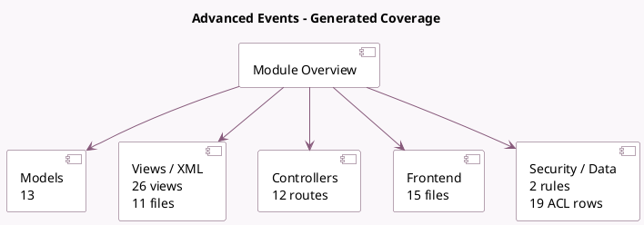

<!-- GENERATED:MODULE -->
---
tags: [odoo, community, module]
---

# Advanced Events

- Scope: Community Addons
- Source: odoo/addons/website_event_track
- Dependencies: [[docs/Community Addons/website_event/website_event|website_event]]

## Summary

Sponsors, Tracks, Agenda, Event News

## Generated coverage

- Models: 13
- XML files with UI/data artifacts: 11
- Views: 26
- Actions: 9
- Menus: 6
- Rules (ir.rule): 2
- Access CSV entries: 19
- Controller units: 2
- Frontend asset files: 15

## Module map

## Detail notes

- Models: [[docs/Community Addons/website_event_track/Models|Models]] (13)
- Views and XML: [[docs/Community Addons/website_event_track/Views|Views]] (11 files)
- Controllers: [[docs/Community Addons/website_event_track/Controllers|Controllers]] (2)
- Frontend: [[docs/Community Addons/website_event_track/Frontend|Frontend]] (15 files)

## Key models

- `event.event`
- `event.track`
- `event.track.location`
- `event.track.stage`
- `event.track.tag`
- `event.track.tag.category`
- `event.track.visitor`
- `event.type`
- `res.config.settings`
- `website`
- `website.event.menu`
- `website.menu`

## Navigation

- [[../Community Addons/Community Addons|Back to scope]]
- [[../../docs/docs|Back to docs]]

<!-- GENERATED:MODULE -->

