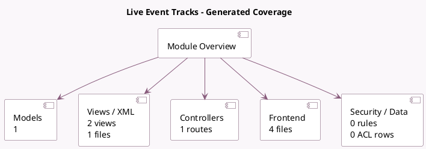

<!-- GENERATED:MODULE -->
---
tags: [odoo, community, module]
---

# Live Event Tracks

- Scope: Community Addons
- Source: odoo/addons/website_event_track_live
- Dependencies: [[docs/Community Addons/website_event_track/website_event_track|website_event_track]]

## Summary

Support live tracks: streaming, participation, youtube

## Generated coverage

- Models: 1
- XML files with UI/data artifacts: 1
- Views: 2
- Actions: 0
- Menus: 0
- Rules (ir.rule): 0
- Access CSV entries: 0
- Controller units: 1
- Frontend asset files: 4

## Module map

## Detail notes

- Models: [[docs/Community Addons/website_event_track_live/Models|Models]] (1)
- Views and XML: [[docs/Community Addons/website_event_track_live/Views|Views]] (1 files)
- Controllers: [[docs/Community Addons/website_event_track_live/Controllers|Controllers]] (1)
- Frontend: [[docs/Community Addons/website_event_track_live/Frontend|Frontend]] (4 files)

## Key models

- `event.track`

## Navigation

- [[../Community Addons/Community Addons|Back to scope]]
- [[../../docs/docs|Back to docs]]

<!-- GENERATED:MODULE -->

