<!-- GENERATED:MODEL -->
---
tags: [odoo, community, generated, model]
---

# event.quiz

- Module: [[docs/Community Addons/website_event_track_quiz/website_event_track_quiz|website_event_track_quiz]]
- Scope: Community Addons
- Defined in module: yes
- Source files: `models/event_quiz.py`
- Python classes: `EventQuiz`
- Description: Quiz

## Field footprint

- Detected fields: 5
- Field types: `Boolean` x 1, `Char` x 1, `Many2one` x 2, `One2many` x 1
- Relation fields: 3

## Sample fields

- `event_id`: `Many2one` (comodel `event.event`, related `event_track_id.event_id`, store `True`)
- `event_track_id`: `Many2one` (comodel `event.track`)
- `name`: `Char` (comodel `Name`)
- `question_ids`: `One2many` (comodel `event.quiz.question`)
- `repeatable`: `Boolean` (comodel `Unlimited Tries`)

## Method hints

- Detected methods: 0
- Action methods: none
- Compute methods: none
- Onchange methods: none

## Direct relation diagram

```plantuml
@startuml
!define ODOO_COLOR_PRIMARY #714B67
!define ODOO_COLOR_ACCENT #875A7B
!define ODOO_COLOR_BG #FAF7FA

skinparam backgroundColor ODOO_COLOR_BG
skinparam defaultTextAlignment left
skinparam ArrowColor ODOO_COLOR_ACCENT
skinparam ClassBackgroundColor white
skinparam ClassBorderColor ODOO_COLOR_PRIMARY
skinparam ComponentBackgroundColor white
skinparam ComponentBorderColor ODOO_COLOR_PRIMARY
skinparam NoteBackgroundColor #FFF8FF
skinparam NoteBorderColor ODOO_COLOR_ACCENT
skinparam SequenceLifeLineBorderColor ODOO_COLOR_ACCENT
skinparam SequenceLifeLineBackgroundColor #FFFFFF
skinparam SequenceParticipantBorderColor ODOO_COLOR_PRIMARY
skinparam SequenceParticipantBackgroundColor #FFFFFF
skinparam sequence {
  ArrowColor ODOO_COLOR_ACCENT
  ActorBorderColor ODOO_COLOR_PRIMARY
}
title event.quiz - Direct Relations
class "event.quiz" as event_quiz
class "event.event" as event_event
class "event.quiz.question" as event_quiz_question
class "event.track" as event_track
event_quiz --|> event_quiz_question : question_ids
event_quiz --> event_track : event_track_id
event_quiz --> event_event : event_id
@enduml
```

## Navigation

- **Parent:** [[docs/Community Addons/website_event_track_quiz/Models]]

<!-- GENERATED:MODEL -->
