<!-- GENERATED:MODEL -->
---
tags: [odoo, community, generated, model]
---

# event.quiz.question

- Module: [[docs/Community Addons/website_event_track_quiz/website_event_track_quiz|website_event_track_quiz]]
- Scope: Community Addons
- Defined in module: yes
- Source files: `models/event_quiz.py`
- Python classes: `EventQuizQuestion`
- Description: Content Quiz Question

## Field footprint

- Detected fields: 6
- Field types: `Char` x 1, `Integer` x 2, `Many2one` x 1, `One2many` x 2
- Relation fields: 3

## Sample fields

- `answer_ids`: `One2many` (comodel `event.quiz.answer`)
- `awarded_points`: `Integer` (comodel `Number of Points`, compute `_compute_awarded_points`)
- `correct_answer_id`: `One2many` (comodel `event.quiz.answer`, compute `_compute_correct_answer_id`)
- `name`: `Char` (comodel `Question`)
- `quiz_id`: `Many2one` (comodel `event.quiz`)
- `sequence`: `Integer` (comodel `Sequence`)

## Method hints

- Detected methods: 3
- Action methods: none
- Compute methods: `_compute_awarded_points`, `_compute_correct_answer_id`
- Onchange methods: none

## Direct relation diagram

```plantuml
@startuml
!define ODOO_COLOR_PRIMARY #714B67
!define ODOO_COLOR_ACCENT #875A7B
!define ODOO_COLOR_BG #FAF7FA

skinparam backgroundColor ODOO_COLOR_BG
skinparam defaultTextAlignment left
skinparam ArrowColor ODOO_COLOR_ACCENT
skinparam ClassBackgroundColor white
skinparam ClassBorderColor ODOO_COLOR_PRIMARY
skinparam ComponentBackgroundColor white
skinparam ComponentBorderColor ODOO_COLOR_PRIMARY
skinparam NoteBackgroundColor #FFF8FF
skinparam NoteBorderColor ODOO_COLOR_ACCENT
skinparam SequenceLifeLineBorderColor ODOO_COLOR_ACCENT
skinparam SequenceLifeLineBackgroundColor #FFFFFF
skinparam SequenceParticipantBorderColor ODOO_COLOR_PRIMARY
skinparam SequenceParticipantBackgroundColor #FFFFFF
skinparam sequence {
  ArrowColor ODOO_COLOR_ACCENT
  ActorBorderColor ODOO_COLOR_PRIMARY
}
title event.quiz.question - Direct Relations
class "event.quiz.question" as event_quiz_question
class "event.quiz" as event_quiz
class "event.quiz.answer" as event_quiz_answer
event_quiz_question --> event_quiz : quiz_id
event_quiz_question --|> event_quiz_answer : correct_answer_id
event_quiz_question --|> event_quiz_answer : answer_ids
@enduml
```

## Navigation

- **Parent:** [[docs/Community Addons/website_event_track_quiz/Models]]

<!-- GENERATED:MODEL -->
