<!-- GENERATED:MODEL -->
---
tags: [odoo, community, generated, model]
---

# event.track

- Module: [[docs/Community Addons/website_event_track_quiz/website_event_track_quiz|website_event_track_quiz]]
- Scope: Community Addons
- Defined in module: extension only
- Source files: `models/event_track.py`
- Python classes: `EventTrack`

## Field footprint

- Detected fields: 5
- Field types: `Boolean` x 1, `Integer` x 2, `Many2one` x 1, `One2many` x 1
- Relation fields: 2

## Sample fields

- `is_quiz_completed`: `Boolean` (comodel `Is Quiz Done`, compute `_compute_quiz_data`)
- `quiz_id`: `Many2one` (comodel `event.quiz`, compute `_compute_quiz_id`, store `True`)
- `quiz_ids`: `One2many` (comodel `event.quiz`)
- `quiz_points`: `Integer` (comodel `Quiz Points`, compute `_compute_quiz_data`)
- `quiz_questions_count`: `Integer` (compute `_compute_quiz_questions_count`)

## Method hints

- Detected methods: 5
- Action methods: `action_add_quiz`, `action_view_quiz`
- Compute methods: `_compute_quiz_data`, `_compute_quiz_id`, `_compute_quiz_questions_count`
- Onchange methods: none

## Direct relation diagram

```plantuml
@startuml
!define ODOO_COLOR_PRIMARY #714B67
!define ODOO_COLOR_ACCENT #875A7B
!define ODOO_COLOR_BG #FAF7FA

skinparam backgroundColor ODOO_COLOR_BG
skinparam defaultTextAlignment left
skinparam ArrowColor ODOO_COLOR_ACCENT
skinparam ClassBackgroundColor white
skinparam ClassBorderColor ODOO_COLOR_PRIMARY
skinparam ComponentBackgroundColor white
skinparam ComponentBorderColor ODOO_COLOR_PRIMARY
skinparam NoteBackgroundColor #FFF8FF
skinparam NoteBorderColor ODOO_COLOR_ACCENT
skinparam SequenceLifeLineBorderColor ODOO_COLOR_ACCENT
skinparam SequenceLifeLineBackgroundColor #FFFFFF
skinparam SequenceParticipantBorderColor ODOO_COLOR_PRIMARY
skinparam SequenceParticipantBackgroundColor #FFFFFF
skinparam sequence {
  ArrowColor ODOO_COLOR_ACCENT
  ActorBorderColor ODOO_COLOR_PRIMARY
}
title event.track - Direct Relations
class "event.track" as event_track
class "event.quiz" as event_quiz
event_track --> event_quiz : quiz_id
event_track --|> event_quiz : quiz_ids
@enduml
```

## Navigation

- **Parent:** [[docs/Community Addons/website_event_track_quiz/Models]]

<!-- GENERATED:MODEL -->
