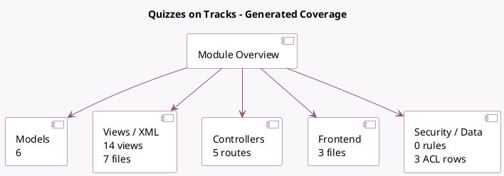

<!-- GENERATED:MODULE -->
---
tags: [odoo, community, module]
---

# Quizzes on Tracks

- Scope: Community Addons
- Source: odoo/addons/website_event_track_quiz
- Dependencies: [[docs/Community Addons/website_profile/website_profile|website_profile]], [[docs/Community Addons/website_event_track/website_event_track|website_event_track]]

## Summary

Quizzes on tracks

## Generated coverage

- Models: 6
- XML files with UI/data artifacts: 7
- Views: 14
- Actions: 2
- Menus: 2
- Rules (ir.rule): 0
- Access CSV entries: 3
- Controller units: 2
- Frontend asset files: 3

## Module map

## Detail notes

- Models: [[docs/Community Addons/website_event_track_quiz/Models|Models]] (6)
- Views and XML: [[docs/Community Addons/website_event_track_quiz/Views|Views]] (7 files)
- Controllers: [[docs/Community Addons/website_event_track_quiz/Controllers|Controllers]] (2)
- Frontend: [[docs/Community Addons/website_event_track_quiz/Frontend|Frontend]] (3 files)

## Key models

- `event.event`
- `event.quiz`
- `event.quiz.answer`
- `event.quiz.question`
- `event.track`
- `event.track.visitor`

## Navigation

- [[../Community Addons/Community Addons|Back to scope]]
- [[../../docs/docs|Back to docs]]

<!-- GENERATED:MODULE -->

