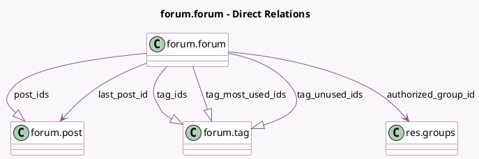

<!-- GENERATED:MODEL -->
---
tags: [odoo, community, generated, model]
---

# forum.forum

- Module: [[docs/Community Addons/website_forum/website_forum|website_forum]]
- Scope: Community Addons
- Defined in module: yes
- Source files: `models/forum_forum.py`
- Python classes: `ForumForum`
- Description: Forum
- Inherits: `image.mixin`, `mail.thread`, `website.multi.mixin`, `website.searchable.mixin`, `website.seo.metadata`

## Field footprint

- Detected fields: 60
- Field types: `Boolean` x 4, `Char` x 1, `Float` x 2, `Html` x 2, `Integer` x 41, `Many2one` x 2, `One2many` x 4, `Selection` x 3, `Text` x 1
- Relation fields: 6

## Sample fields

- `active`: `Boolean`
- `allow_share`: `Boolean` (comodel `Sharing Options`)
- `authorized_group_id`: `Many2one` (comodel `res.groups`)
- `can_moderate`: `Boolean` (compute `_compute_can_moderate`)
- `count_flagged_posts`: `Integer` (compute `_compute_count_flagged_posts`)
- `count_posts_waiting_validation`: `Integer` (compute `_compute_count_posts_waiting_validation`)
- `default_order`: `Selection`
- `description`: `Text` (comodel `Description`)
- `faq`: `Html` (comodel `Guidelines`)
- `has_pending_post`: `Boolean` (compute `_compute_has_pending_post`)
- `karma_answer`: `Integer`
- `karma_answer_accept_all`: `Integer`
- `karma_answer_accept_own`: `Integer`
- `karma_ask`: `Integer`
- `karma_close_all`: `Integer`
- `karma_close_own`: `Integer`
- `karma_comment_all`: `Integer`
- `karma_comment_convert_all`: `Integer`
- `karma_comment_convert_own`: `Integer`
- `karma_comment_own`: `Integer`

## Method hints

- Detected methods: 18
- Action methods: none
- Compute methods: `_compute_can_moderate`, `_compute_count_flagged_posts`, `_compute_count_posts_waiting_validation`, `_compute_forum_statistics`, `_compute_has_pending_post`, `_compute_last_post_id`, `_compute_tag_ids_usage`, `_compute_website_url`
- Onchange methods: none

## Direct relation diagram

## Navigation

- **Parent:** [[docs/Community Addons/website_forum/Models]]

<!-- GENERATED:MODEL -->
