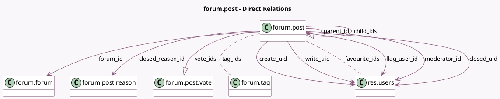

<!-- GENERATED:MODEL -->
---
tags: [odoo, community, generated, model]
---

# forum.post

- Module: [[docs/Community Addons/website_forum/website_forum|website_forum]]
- Scope: Community Addons
- Defined in module: yes
- Source files: `models/forum_post.py`
- Python classes: `ForumPost`
- Description: Forum Post
- Inherits: `mail.thread`, `website.searchable.mixin`, `website.seo.metadata`

## Field footprint

- Detected fields: 58
- Field types: `Boolean` x 22, `Char` x 2, `Datetime` x 4, `Float` x 1, `Html` x 1, `Integer` x 12, `Many2many` x 2, `Many2one` x 9, `One2many` x 3, `Selection` x 1, `Text` x 1
- Relation fields: 14

## Sample fields

- `active`: `Boolean` (comodel `Active`)
- `can_accept`: `Boolean` (comodel `Can Accept`, compute `_compute_post_karma_rights`)
- `can_answer`: `Boolean` (comodel `Can Answer`, compute `_compute_post_karma_rights`)
- `can_ask`: `Boolean` (comodel `Can Ask`, compute `_compute_post_karma_rights`)
- `can_close`: `Boolean` (comodel `Can Close`, compute `_compute_post_karma_rights`)
- `can_comment`: `Boolean` (comodel `Can Comment`, compute `_compute_post_karma_rights`)
- `can_comment_convert`: `Boolean` (comodel `Can Convert to Comment`, compute `_compute_post_karma_rights`)
- `can_display_biography`: `Boolean` (comodel `Is the author's biography visible from his post`, compute `_compute_post_karma_rights`)
- `can_downvote`: `Boolean` (comodel `Can Downvote`, compute `_compute_post_karma_rights`)
- `can_edit`: `Boolean` (comodel `Can Edit`, compute `_compute_post_karma_rights`)
- `can_flag`: `Boolean` (comodel `Can Flag`, compute `_compute_post_karma_rights`)
- `can_moderate`: `Boolean` (comodel `Can Moderate`, compute `_compute_post_karma_rights`)
- `can_post`: `Boolean` (comodel `Can Automatically be Validated`, compute `_compute_post_karma_rights`)
- `can_unlink`: `Boolean` (comodel `Can Unlink`, compute `_compute_post_karma_rights`)
- `can_upvote`: `Boolean` (comodel `Can Upvote`, compute `_compute_post_karma_rights`)
- `can_use_full_editor`: `Boolean` (comodel `Can Use Full Editor`, compute `_compute_post_karma_rights`)
- `can_view`: `Boolean` (comodel `Can View`, compute `_compute_post_karma_rights`)
- `child_count`: `Integer` (comodel `Answers`, compute `_compute_child_count`, store `True`)
- `child_ids`: `One2many` (comodel `forum.post`)
- `closed_date`: `Datetime` (comodel `Closed on`)

## Method hints

- Detected methods: 45
- Action methods: none
- Compute methods: `_compute_child_count`, `_compute_favorite_count`, `_compute_has_validated_answer`, `_compute_plain_content`, `_compute_post_karma_rights`, `_compute_relevancy`, `_compute_self_reply`, `_compute_uid_has_answered`, and 4 more
- Onchange methods: none

## Direct relation diagram

## Navigation

- **Parent:** [[docs/Community Addons/website_forum/Models]]

<!-- GENERATED:MODEL -->
