<!-- GENERATED:MODEL -->
---
tags: [odoo, community, generated, model]
---

# forum.post.vote

- Module: [[docs/Community Addons/website_forum/website_forum|website_forum]]
- Scope: Community Addons
- Defined in module: yes
- Source files: `models/forum_post_vote.py`
- Python classes: `ForumPostVote`
- Description: Post Vote

## Field footprint

- Detected fields: 6
- Field types: `Datetime` x 1, `Many2one` x 4, `Selection` x 1
- Relation fields: 4

## Sample fields

- `create_date`: `Datetime` (comodel `Create Date`)
- `forum_id`: `Many2one` (comodel `forum.forum`, related `post_id.forum_id`, store `True`)
- `post_id`: `Many2one` (comodel `forum.post`)
- `recipient_id`: `Many2one` (comodel `res.users`, related `post_id.create_uid`, store `True`)
- `user_id`: `Many2one` (comodel `res.users`)
- `vote`: `Selection`

## Method hints

- Detected methods: 6
- Action methods: none
- Compute methods: none
- Onchange methods: none

## Direct relation diagram

```plantuml
@startuml
!define ODOO_COLOR_PRIMARY #714B67
!define ODOO_COLOR_ACCENT #875A7B
!define ODOO_COLOR_BG #FAF7FA

skinparam backgroundColor ODOO_COLOR_BG
skinparam defaultTextAlignment left
skinparam ArrowColor ODOO_COLOR_ACCENT
skinparam ClassBackgroundColor white
skinparam ClassBorderColor ODOO_COLOR_PRIMARY
skinparam ComponentBackgroundColor white
skinparam ComponentBorderColor ODOO_COLOR_PRIMARY
skinparam NoteBackgroundColor #FFF8FF
skinparam NoteBorderColor ODOO_COLOR_ACCENT
skinparam SequenceLifeLineBorderColor ODOO_COLOR_ACCENT
skinparam SequenceLifeLineBackgroundColor #FFFFFF
skinparam SequenceParticipantBorderColor ODOO_COLOR_PRIMARY
skinparam SequenceParticipantBackgroundColor #FFFFFF
skinparam sequence {
  ArrowColor ODOO_COLOR_ACCENT
  ActorBorderColor ODOO_COLOR_PRIMARY
}
title forum.post.vote - Direct Relations
class "forum.post.vote" as forum_post_vote
class "forum.forum" as forum_forum
class "forum.post" as forum_post
class "res.users" as res_users
forum_post_vote --> forum_post : post_id
forum_post_vote --> res_users : user_id
forum_post_vote --> forum_forum : forum_id
forum_post_vote --> res_users : recipient_id
@enduml
```

## Navigation

- **Parent:** [[docs/Community Addons/website_forum/Models]]

<!-- GENERATED:MODEL -->
