<!-- GENERATED:MODEL -->
---
tags: [odoo, community, generated, model]
---

# forum.tag

- Module: [[docs/Community Addons/website_forum/website_forum|website_forum]]
- Scope: Community Addons
- Defined in module: yes
- Source files: `models/forum_tag.py`
- Python classes: `ForumTag`
- Description: Forum Tag
- Inherits: `mail.thread`, `website.searchable.mixin`, `website.seo.metadata`

## Field footprint

- Detected fields: 6
- Field types: `Char` x 2, `Integer` x 2, `Many2many` x 1, `Many2one` x 1
- Relation fields: 2

## Sample fields

- `color`: `Integer` (comodel `Color`)
- `forum_id`: `Many2one` (comodel `forum.forum`)
- `name`: `Char` (comodel `Name`)
- `post_ids`: `Many2many` (comodel `forum.post`)
- `posts_count`: `Integer` (comodel `Number of Posts`, compute `_compute_posts_count`, store `True`)
- `website_url`: `Char` (comodel `Link to questions with the tag`, compute `_compute_website_url`)

## Method hints

- Detected methods: 4
- Action methods: none
- Compute methods: `_compute_posts_count`, `_compute_website_url`
- Onchange methods: none

## Direct relation diagram

```plantuml
@startuml
!define ODOO_COLOR_PRIMARY #714B67
!define ODOO_COLOR_ACCENT #875A7B
!define ODOO_COLOR_BG #FAF7FA

skinparam backgroundColor ODOO_COLOR_BG
skinparam defaultTextAlignment left
skinparam ArrowColor ODOO_COLOR_ACCENT
skinparam ClassBackgroundColor white
skinparam ClassBorderColor ODOO_COLOR_PRIMARY
skinparam ComponentBackgroundColor white
skinparam ComponentBorderColor ODOO_COLOR_PRIMARY
skinparam NoteBackgroundColor #FFF8FF
skinparam NoteBorderColor ODOO_COLOR_ACCENT
skinparam SequenceLifeLineBorderColor ODOO_COLOR_ACCENT
skinparam SequenceLifeLineBackgroundColor #FFFFFF
skinparam SequenceParticipantBorderColor ODOO_COLOR_PRIMARY
skinparam SequenceParticipantBackgroundColor #FFFFFF
skinparam sequence {
  ArrowColor ODOO_COLOR_ACCENT
  ActorBorderColor ODOO_COLOR_PRIMARY
}
title forum.tag - Direct Relations
class "forum.tag" as forum_tag
class "forum.forum" as forum_forum
class "forum.post" as forum_post
forum_tag --> forum_forum : forum_id
forum_tag .. forum_post : post_ids
@enduml
```

## Navigation

- **Parent:** [[docs/Community Addons/website_forum/Models]]

<!-- GENERATED:MODEL -->
