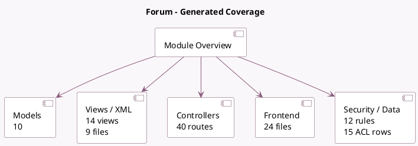

<!-- GENERATED:MODULE -->
---
tags: [odoo, community, module]
---

# Forum

- Scope: Community Addons
- Source: odoo/addons/website_forum
- Dependencies: [[docs/Community Addons/auth_signup/auth_signup|auth_signup]], [[docs/Community Addons/website_mail/website_mail|website_mail]], [[docs/Community Addons/website_profile/website_profile|website_profile]]

## Summary

Manage a forum with FAQ and Q&A

## Generated coverage

- Models: 10
- XML files with UI/data artifacts: 9
- Views: 14
- Actions: 9
- Menus: 7
- Rules (ir.rule): 12
- Access CSV entries: 15
- Controller units: 2
- Frontend asset files: 24

## Module map

## Detail notes

- Models: [[docs/Community Addons/website_forum/Models|Models]] (10)
- Views and XML: [[docs/Community Addons/website_forum/Views|Views]] (9 files)
- Controllers: [[docs/Community Addons/website_forum/Controllers|Controllers]] (2)
- Frontend: [[docs/Community Addons/website_forum/Frontend|Frontend]] (24 files)

## Key models

- `forum.forum`
- `forum.post`
- `forum.post.reason`
- `forum.post.vote`
- `forum.tag`
- `gamification.challenge`
- `gamification.karma.tracking`
- `ir.attachment`
- `res.users`
- `website`

## Navigation

- [[../Community Addons/Community Addons|Back to scope]]
- [[../../docs/docs|Back to docs]]

<!-- GENERATED:MODULE -->

