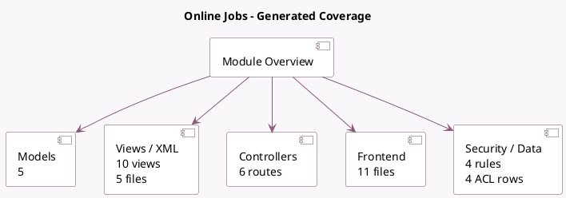

<!-- GENERATED:MODULE -->
---
tags: [odoo, community, module]
---

# Online Jobs

- Scope: Community Addons
- Source: odoo/addons/website_hr_recruitment
- Dependencies: [[docs/Community Addons/hr_recruitment/hr_recruitment|hr_recruitment]], [[docs/Community Addons/website_mail/website_mail|website_mail]]

## Summary

Manage your online hiring process

## Generated coverage

- Models: 5
- XML files with UI/data artifacts: 5
- Views: 10
- Actions: 3
- Menus: 1
- Rules (ir.rule): 4
- Access CSV entries: 4
- Controller units: 1
- Frontend asset files: 11

## Module map

## Detail notes

- Models: [[docs/Community Addons/website_hr_recruitment/Models|Models]] (5)
- Views and XML: [[docs/Community Addons/website_hr_recruitment/Views|Views]] (5 files)
- Controllers: [[docs/Community Addons/website_hr_recruitment/Controllers|Controllers]] (1)
- Frontend: [[docs/Community Addons/website_hr_recruitment/Frontend|Frontend]] (11 files)

## Key models

- `hr.applicant`
- `hr.department`
- `hr.job`
- `hr.recruitment.source`
- `website`

## Navigation

- [[../Community Addons/Community Addons|Back to scope]]
- [[../../docs/docs|Back to docs]]

<!-- GENERATED:MODULE -->

