<!-- GENERATED:MODEL -->
---
tags: [odoo, community, generated, model]
---

# website.visitor

- Module: [[docs/Community Addons/website_livechat/website_livechat|website_livechat]]
- Scope: Community Addons
- Defined in module: extension only
- Source files: `models/website_visitor.py`
- Python classes: `WebsiteVisitor`

## Field footprint

- Detected fields: 4
- Field types: `Char` x 1, `Integer` x 1, `Many2one` x 1, `One2many` x 1
- Relation fields: 2

## Sample fields

- `discuss_channel_ids`: `One2many` (comodel `discuss.channel`)
- `livechat_operator_id`: `Many2one` (comodel `res.partner`, compute `_compute_livechat_operator_id`, store `True`)
- `livechat_operator_name`: `Char` (comodel `Operator Name`, related `livechat_operator_id.name`)
- `session_count`: `Integer` (comodel `# Sessions`, compute `_compute_session_count`)

## Method hints

- Detected methods: 8
- Action methods: `action_send_chat_request`
- Compute methods: `_compute_livechat_operator_id`, `_compute_session_count`
- Onchange methods: none

## Direct relation diagram

```plantuml
@startuml
!define ODOO_COLOR_PRIMARY #714B67
!define ODOO_COLOR_ACCENT #875A7B
!define ODOO_COLOR_BG #FAF7FA

skinparam backgroundColor ODOO_COLOR_BG
skinparam defaultTextAlignment left
skinparam ArrowColor ODOO_COLOR_ACCENT
skinparam ClassBackgroundColor white
skinparam ClassBorderColor ODOO_COLOR_PRIMARY
skinparam ComponentBackgroundColor white
skinparam ComponentBorderColor ODOO_COLOR_PRIMARY
skinparam NoteBackgroundColor #FFF8FF
skinparam NoteBorderColor ODOO_COLOR_ACCENT
skinparam SequenceLifeLineBorderColor ODOO_COLOR_ACCENT
skinparam SequenceLifeLineBackgroundColor #FFFFFF
skinparam SequenceParticipantBorderColor ODOO_COLOR_PRIMARY
skinparam SequenceParticipantBackgroundColor #FFFFFF
skinparam sequence {
  ArrowColor ODOO_COLOR_ACCENT
  ActorBorderColor ODOO_COLOR_PRIMARY
}
title website.visitor - Direct Relations
class "website.visitor" as website_visitor
class "discuss.channel" as discuss_channel
class "res.partner" as res_partner
website_visitor --> res_partner : livechat_operator_id
website_visitor --|> discuss_channel : discuss_channel_ids
@enduml
```

## Navigation

- **Parent:** [[docs/Community Addons/website_livechat/Models]]

<!-- GENERATED:MODEL -->
