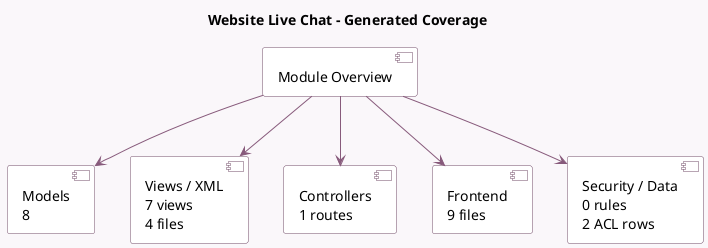

<!-- GENERATED:MODULE -->
---
tags: [odoo, community, module]
---

# Website Live Chat

- Scope: Community Addons
- Source: odoo/addons/website_livechat
- Dependencies: [[docs/Community Addons/website/website|website]], [[docs/Community Addons/im_livechat/im_livechat|im_livechat]]

## Summary

Chat with your website visitors

## Generated coverage

- Models: 8
- XML files with UI/data artifacts: 4
- Views: 7
- Actions: 5
- Menus: 1
- Rules (ir.rule): 0
- Access CSV entries: 2
- Controller units: 1
- Frontend asset files: 9

## Module map

## Detail notes

- Models: [[docs/Community Addons/website_livechat/Models|Models]] (8)
- Views and XML: [[docs/Community Addons/website_livechat/Views|Views]] (4 files)
- Controllers: [[docs/Community Addons/website_livechat/Controllers|Controllers]] (1)
- Frontend: [[docs/Community Addons/website_livechat/Frontend|Frontend]] (9 files)

## Key models

- `chatbot.script`
- `chatbot.script.step`
- `discuss.channel`
- `im_livechat.channel`
- `ir.http`
- `res.config.settings`
- `website`
- `website.visitor`

## Navigation

- [[../Community Addons/Community Addons|Back to scope]]
- [[../../docs/docs|Back to docs]]

<!-- GENERATED:MODULE -->

