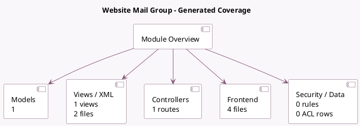

<!-- GENERATED:MODULE -->
---
tags: [odoo, community, module]
---

# Website Mail Group

- Scope: Community Addons
- Source: odoo/addons/website_mail_group
- Dependencies: [[docs/Community Addons/mail_group/mail_group|mail_group]], [[docs/Community Addons/website/website|website]]

## Summary

Add a website snippet for the mail groups.

## Generated coverage

- Models: 1
- XML files with UI/data artifacts: 2
- Views: 1
- Actions: 0
- Menus: 3
- Rules (ir.rule): 0
- Access CSV entries: 0
- Controller units: 1
- Frontend asset files: 4

## Module map

## Detail notes

- Models: [[docs/Community Addons/website_mail_group/Models|Models]] (1)
- Views and XML: [[docs/Community Addons/website_mail_group/Views|Views]] (2 files)
- Controllers: [[docs/Community Addons/website_mail_group/Controllers|Controllers]] (1)
- Frontend: [[docs/Community Addons/website_mail_group/Frontend|Frontend]] (4 files)

## Key models

- `mail.group`

## Navigation

- [[../Community Addons/Community Addons|Back to scope]]
- [[../../docs/docs|Back to docs]]

<!-- GENERATED:MODULE -->

