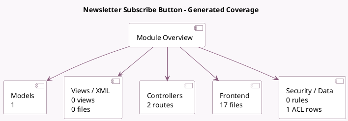

<!-- GENERATED:MODULE -->
---
tags: [odoo, community, module]
---

# Newsletter Subscribe Button

- Scope: Community Addons
- Source: odoo/addons/website_mass_mailing
- Dependencies: [[docs/Community Addons/website/website|website]], [[docs/Community Addons/mass_mailing/mass_mailing|mass_mailing]], [[docs/Community Addons/google_recaptcha/google_recaptcha|google_recaptcha]]

## Summary

Attract visitors to subscribe to mailing lists

## Generated coverage

- Models: 1
- XML files with UI/data artifacts: 0
- Views: 0
- Actions: 0
- Menus: 0
- Rules (ir.rule): 0
- Access CSV entries: 1
- Controller units: 1
- Frontend asset files: 17

## Module map

## Detail notes

- Models: [[docs/Community Addons/website_mass_mailing/Models|Models]] (1)
- Controllers: [[docs/Community Addons/website_mass_mailing/Controllers|Controllers]] (1)
- Frontend: [[docs/Community Addons/website_mass_mailing/Frontend|Frontend]] (17 files)

## Key models

- `res.company`

## Navigation

- [[../Community Addons/Community Addons|Back to scope]]
- [[../../docs/docs|Back to docs]]

<!-- GENERATED:MODULE -->

