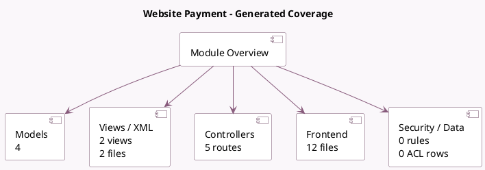

<!-- GENERATED:MODULE -->
---
tags: [odoo, community, module]
---

# Website Payment

- Scope: Community Addons
- Source: odoo/addons/website_payment
- Dependencies: [[docs/Community Addons/website/website|website]], [[docs/Community Addons/account_payment/account_payment|account_payment]], [[docs/Community Addons/portal/portal|portal]]

## Summary

Payment integration with website

## Generated coverage

- Models: 4
- XML files with UI/data artifacts: 2
- Views: 2
- Actions: 0
- Menus: 0
- Rules (ir.rule): 0
- Access CSV entries: 0
- Controller units: 2
- Frontend asset files: 12

## Module map

## Detail notes

- Models: [[docs/Community Addons/website_payment/Models|Models]] (4)
- Views and XML: [[docs/Community Addons/website_payment/Views|Views]] (2 files)
- Controllers: [[docs/Community Addons/website_payment/Controllers|Controllers]] (2)
- Frontend: [[docs/Community Addons/website_payment/Frontend|Frontend]] (12 files)

## Key models

- `account.payment`
- `payment.provider`
- `payment.transaction`
- `res.config.settings`

## Navigation

- [[../Community Addons/Community Addons|Back to scope]]
- [[../../docs/docs|Back to docs]]

<!-- GENERATED:MODULE -->

