<!-- GENERATED:MODEL -->
---
tags: [odoo, community, generated, model]
---

# crm.team

- Module: [[docs/Community Addons/website_sale/website_sale|website_sale]]
- Scope: Community Addons
- Defined in module: extension only
- Source files: `models/crm_team.py`
- Python classes: `CrmTeam`

## Field footprint

- Detected fields: 3
- Field types: `Integer` x 2, `One2many` x 1
- Relation fields: 1

## Sample fields

- `abandoned_carts_amount`: `Integer` (compute `_compute_abandoned_carts`)
- `abandoned_carts_count`: `Integer` (compute `_compute_abandoned_carts`)
- `website_ids`: `One2many` (comodel `website`)

## Method hints

- Detected methods: 2
- Action methods: none
- Compute methods: `_compute_abandoned_carts`
- Onchange methods: none

## Direct relation diagram

```plantuml
@startuml
!define ODOO_COLOR_PRIMARY #714B67
!define ODOO_COLOR_ACCENT #875A7B
!define ODOO_COLOR_BG #FAF7FA

skinparam backgroundColor ODOO_COLOR_BG
skinparam defaultTextAlignment left
skinparam ArrowColor ODOO_COLOR_ACCENT
skinparam ClassBackgroundColor white
skinparam ClassBorderColor ODOO_COLOR_PRIMARY
skinparam ComponentBackgroundColor white
skinparam ComponentBorderColor ODOO_COLOR_PRIMARY
skinparam NoteBackgroundColor #FFF8FF
skinparam NoteBorderColor ODOO_COLOR_ACCENT
skinparam SequenceLifeLineBorderColor ODOO_COLOR_ACCENT
skinparam SequenceLifeLineBackgroundColor #FFFFFF
skinparam SequenceParticipantBorderColor ODOO_COLOR_PRIMARY
skinparam SequenceParticipantBackgroundColor #FFFFFF
skinparam sequence {
  ArrowColor ODOO_COLOR_ACCENT
  ActorBorderColor ODOO_COLOR_PRIMARY
}
title crm.team - Direct Relations
class "crm.team" as crm_team
class "website" as website
crm_team --|> website : website_ids
@enduml
```

## Navigation

- **Parent:** [[docs/Community Addons/website_sale/Models]]

<!-- GENERATED:MODEL -->
