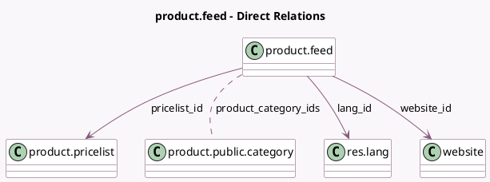

<!-- GENERATED:MODEL -->
---
tags: [odoo, community, generated, model]
---

# product.feed

- Module: [[docs/Community Addons/website_sale/website_sale|website_sale]]
- Scope: Community Addons
- Defined in module: yes
- Source files: `models/product_feed.py`
- Python classes: `ProductFeed`
- Description: Product Feed
- Inherits: `mail.thread`

## Field footprint

- Detected fields: 12
- Field types: `Binary` x 1, `Char` x 3, `Date` x 1, `Datetime` x 1, `Many2many` x 2, `Many2one` x 3, `Selection` x 1
- Relation fields: 5

## Sample fields

- `access_token`: `Char`
- `cache_expiry`: `Datetime`
- `feed_cache`: `Binary` (compute `_compute_feed_cache`, store `True`)
- `lang_id`: `Many2one` (comodel `res.lang`, compute `_compute_lang_id`, store `True`)
- `last_notification_date`: `Date`
- `name`: `Char`
- `pricelist_id`: `Many2one` (comodel `product.pricelist`)
- `product_category_ids`: `Many2many` (comodel `product.public.category`)
- `target`: `Selection`
- `url`: `Char` (compute `_compute_url`)
- `website_id`: `Many2one` (comodel `website`)
- `website_lang_ids`: `Many2many` (related `website_id.language_ids`)

## Method hints

- Detected methods: 16
- Action methods: `action_invalidate_cache`
- Compute methods: `_compute_feed_cache`, `_compute_lang_id`, `_compute_url`
- Onchange methods: none

## Direct relation diagram

## Navigation

- **Parent:** [[docs/Community Addons/website_sale/Models]]

<!-- GENERATED:MODEL -->
