<!-- GENERATED:MODEL -->
---
tags: [odoo, community, generated, model]
---

# product.image

- Module: [[docs/Community Addons/website_sale/website_sale|website_sale]]
- Scope: Community Addons
- Defined in module: yes
- Source files: `models/product_image.py`
- Python classes: `ProductImage`
- Description: Product Image
- Inherits: `image.mixin`

## Field footprint

- Detected fields: 8
- Field types: `Boolean` x 1, `Char` x 2, `Html` x 1, `Image` x 1, `Integer` x 1, `Many2one` x 2
- Relation fields: 2

## Sample fields

- `can_image_1024_be_zoomed`: `Boolean` (compute `_compute_can_image_1024_be_zoomed`, store `True`)
- `embed_code`: `Html` (compute `_compute_embed_code`)
- `image_1920`: `Image`
- `name`: `Char`
- `product_tmpl_id`: `Many2one` (comodel `product.template`)
- `product_variant_id`: `Many2one` (comodel `product.product`)
- `sequence`: `Integer`
- `video_url`: `Char`

## Method hints

- Detected methods: 5
- Action methods: none
- Compute methods: `_compute_can_image_1024_be_zoomed`, `_compute_embed_code`
- Onchange methods: `_onchange_video_url`

## Direct relation diagram

```plantuml
@startuml
!define ODOO_COLOR_PRIMARY #714B67
!define ODOO_COLOR_ACCENT #875A7B
!define ODOO_COLOR_BG #FAF7FA

skinparam backgroundColor ODOO_COLOR_BG
skinparam defaultTextAlignment left
skinparam ArrowColor ODOO_COLOR_ACCENT
skinparam ClassBackgroundColor white
skinparam ClassBorderColor ODOO_COLOR_PRIMARY
skinparam ComponentBackgroundColor white
skinparam ComponentBorderColor ODOO_COLOR_PRIMARY
skinparam NoteBackgroundColor #FFF8FF
skinparam NoteBorderColor ODOO_COLOR_ACCENT
skinparam SequenceLifeLineBorderColor ODOO_COLOR_ACCENT
skinparam SequenceLifeLineBackgroundColor #FFFFFF
skinparam SequenceParticipantBorderColor ODOO_COLOR_PRIMARY
skinparam SequenceParticipantBackgroundColor #FFFFFF
skinparam sequence {
  ArrowColor ODOO_COLOR_ACCENT
  ActorBorderColor ODOO_COLOR_PRIMARY
}
title product.image - Direct Relations
class "product.image" as product_image
class "product.product" as product_product
class "product.template" as product_template
product_image --> product_template : product_tmpl_id
product_image --> product_product : product_variant_id
@enduml
```

## Navigation

- **Parent:** [[docs/Community Addons/website_sale/Models]]

<!-- GENERATED:MODEL -->
