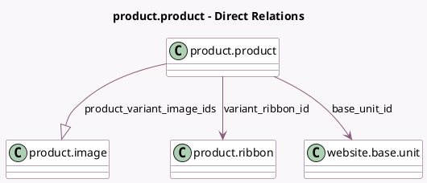

<!-- GENERATED:MODEL -->
---
tags: [odoo, community, generated, model]
---

# product.product

- Module: [[docs/Community Addons/website_sale/website_sale|website_sale]]
- Scope: Community Addons
- Defined in module: extension only
- Source files: `models/product_product.py`
- Python classes: `ProductProduct`

## Field footprint

- Detected fields: 8
- Field types: `Char` x 2, `Float` x 1, `Many2one` x 3, `Monetary` x 1, `One2many` x 1
- Relation fields: 4

## Sample fields

- `base_unit_count`: `Float`
- `base_unit_id`: `Many2one` (comodel `website.base.unit`)
- `base_unit_name`: `Char` (compute `_compute_base_unit_name`)
- `base_unit_price`: `Monetary` (compute `_compute_base_unit_price`)
- `product_variant_image_ids`: `One2many` (comodel `product.image`)
- `variant_ribbon_id`: `Many2one` (comodel `product.ribbon`)
- `website_id`: `Many2one` (related `product_tmpl_id.website_id`)
- `website_url`: `Char` (compute `_compute_product_website_url`)

## Method hints

- Detected methods: 17
- Action methods: none
- Compute methods: `_compute_base_unit_name`, `_compute_base_unit_price`, `_compute_product_website_url`
- Onchange methods: `_onchange_public_categ_ids`

## Direct relation diagram

## Navigation

- **Parent:** [[docs/Community Addons/website_sale/Models]]

<!-- GENERATED:MODEL -->
