<!-- GENERATED:MODEL -->
---
tags: [odoo, community, generated, model]
---

# product.public.category

- Module: [[docs/Community Addons/website_sale/website_sale|website_sale]]
- Scope: Community Addons
- Defined in module: yes
- Source files: `models/product_public_category.py`
- Python classes: `ProductPublicCategory`
- Description: Website Product Category
- Inherits: `image.mixin`, `website.multi.mixin`, `website.searchable.mixin`, `website.seo.metadata`

## Field footprint

- Detected fields: 14
- Field types: `Boolean` x 4, `Char` x 2, `Html` x 2, `Image` x 1, `Integer` x 1, `Many2many` x 2, `Many2one` x 1, `One2many` x 1
- Relation fields: 4

## Sample fields

- `align_category_content`: `Boolean`
- `child_id`: `One2many` (comodel `product.public.category`)
- `cover_image`: `Image`
- `has_published_products`: `Boolean` (compute `_compute_has_published_products`)
- `name`: `Char`
- `parent_id`: `Many2one` (comodel `product.public.category`)
- `parent_path`: `Char`
- `parents_and_self`: `Many2many` (comodel `product.public.category`, compute `_compute_parents_and_self`)
- `product_tmpl_ids`: `Many2many` (comodel `product.template`)
- `sequence`: `Integer`
- `show_category_description`: `Boolean`
- `show_category_title`: `Boolean`
- `website_description`: `Html`
- `website_footer`: `Html`

## Method hints

- Detected methods: 10
- Action methods: none
- Compute methods: `_compute_display_name`, `_compute_has_published_products`, `_compute_parents_and_self`
- Onchange methods: none

## Direct relation diagram

```plantuml
@startuml
!define ODOO_COLOR_PRIMARY #714B67
!define ODOO_COLOR_ACCENT #875A7B
!define ODOO_COLOR_BG #FAF7FA

skinparam backgroundColor ODOO_COLOR_BG
skinparam defaultTextAlignment left
skinparam ArrowColor ODOO_COLOR_ACCENT
skinparam ClassBackgroundColor white
skinparam ClassBorderColor ODOO_COLOR_PRIMARY
skinparam ComponentBackgroundColor white
skinparam ComponentBorderColor ODOO_COLOR_PRIMARY
skinparam NoteBackgroundColor #FFF8FF
skinparam NoteBorderColor ODOO_COLOR_ACCENT
skinparam SequenceLifeLineBorderColor ODOO_COLOR_ACCENT
skinparam SequenceLifeLineBackgroundColor #FFFFFF
skinparam SequenceParticipantBorderColor ODOO_COLOR_PRIMARY
skinparam SequenceParticipantBackgroundColor #FFFFFF
skinparam sequence {
  ArrowColor ODOO_COLOR_ACCENT
  ActorBorderColor ODOO_COLOR_PRIMARY
}
title product.public.category - Direct Relations
class "product.public.category" as product_public_category
class "product.public.category" as product_public_category
class "product.template" as product_template
product_public_category --> product_public_category : parent_id
product_public_category --|> product_public_category : child_id
product_public_category .. product_public_category : parents_and_self
product_public_category .. product_template : product_tmpl_ids
@enduml
```

## Navigation

- **Parent:** [[docs/Community Addons/website_sale/Models]]

<!-- GENERATED:MODEL -->
