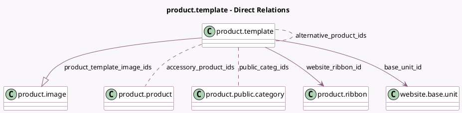

<!-- GENERATED:MODEL -->
---
tags: [odoo, community, generated, model]
---

# product.template

- Module: [[docs/Community Addons/website_sale/website_sale|website_sale]]
- Scope: Community Addons
- Defined in module: yes
- Source files: `models/product_template.py`
- Python classes: `ProductTemplate`
- Inherits: `rating.mixin`, `website.published.multi.mixin`, `website.searchable.mixin`, `website.seo.metadata`

## Field footprint

- Detected fields: 19
- Field types: `Char` x 2, `Datetime` x 1, `Float` x 1, `Html` x 3, `Integer` x 3, `Many2many` x 3, `Many2one` x 2, `Monetary` x 2, `One2many` x 1, `Text` x 1
- Relation fields: 6

## Sample fields

- `accessory_product_ids`: `Many2many` (comodel `product.product`)
- `alternative_product_ids`: `Many2many` (comodel `product.template`)
- `base_unit_count`: `Float` (compute `_compute_base_unit_count`, store `True`)
- `base_unit_id`: `Many2one` (comodel `website.base.unit`, compute `_compute_base_unit_id`, store `True`)
- `base_unit_name`: `Char` (compute `_compute_base_unit_name`)
- `base_unit_price`: `Monetary` (compute `_compute_base_unit_price`)
- `compare_list_price`: `Monetary`
- `description`: `Html`
- `description_ecommerce`: `Html`
- `description_sale`: `Text`
- `product_template_image_ids`: `One2many` (comodel `product.image`)
- `public_categ_ids`: `Many2many` (comodel `product.public.category`)
- `publish_date`: `Datetime` (compute `_compute_publish_date`, store `True`)
- `variants_default_code`: `Char` (compute `_compute_variants_default_code`, store `True`)
- `website_description`: `Html`
- `website_ribbon_id`: `Many2one` (comodel `product.ribbon`)
- `website_sequence`: `Integer`
- `website_size_x`: `Integer`
- `website_size_y`: `Integer`

## Method hints

- Detected methods: 52
- Action methods: none
- Compute methods: `_compute_base_unit_count`, `_compute_base_unit_id`, `_compute_base_unit_name`, `_compute_base_unit_price`, `_compute_publish_date`, `_compute_variants_default_code`, `_compute_website_url`
- Onchange methods: none

## Direct relation diagram

## Navigation

- **Parent:** [[docs/Community Addons/website_sale/Models]]

<!-- GENERATED:MODEL -->
