<!-- GENERATED:MODEL -->
---
tags: [odoo, community, generated, model]
---

# res.config.settings

- Module: [[docs/Community Addons/website_sale/website_sale|website_sale]]
- Scope: Community Addons
- Defined in module: extension only
- Source files: `models/res_config_settings.py`
- Python classes: `ResConfigSettings`

## Field footprint

- Detected fields: 17
- Field types: `Boolean` x 7, `Char` x 1, `Float` x 1, `Many2one` x 4, `Selection` x 4
- Relation fields: 4

## Sample fields

- `account_on_checkout`: `Selection` (compute `_compute_account_on_checkout`)
- `add_to_cart_action`: `Selection` (related `website_id.add_to_cart_action`)
- `cart_abandoned_delay`: `Float` (related `website_id.cart_abandoned_delay`)
- `cart_recovery_mail_template`: `Many2one` (related `website_id.cart_recovery_mail_template_id`)
- `confirmation_email_template_id`: `Many2one` (related `website_id.confirmation_email_template_id`)
- `ecommerce_access`: `Selection` (related `website_id.ecommerce_access`)
- `group_gmc_feed`: `Boolean` (related `website_id.enabled_gmc_src`)
- `group_product_price_comparison`: `Boolean`
- `group_show_uom_price`: `Boolean`
- `module_website_sale_autocomplete`: `Boolean` (comodel `Address Autocomplete`)
- `module_website_sale_collect`: `Boolean` (comodel `Click & Collect`)
- `salesperson_id`: `Many2one` (related `website_id.salesperson_id`)
- `salesteam_id`: `Many2one` (related `website_id.salesteam_id`)
- `send_abandoned_cart_email`: `Boolean` (related `website_id.send_abandoned_cart_email`)
- `show_line_subtotals_tax_selection`: `Selection` (related `website_id.show_line_subtotals_tax_selection`)
- `website_sale_contact_us_button_url`: `Char` (related `website_id.contact_us_button_url`)
- `website_sale_prevent_zero_price_sale`: `Boolean` (related `website_id.prevent_zero_price_sale`)

## Method hints

- Detected methods: 8
- Action methods: `action_open_abandoned_cart_mail_template`, `action_open_extra_info`, `action_open_product_feeds`, `action_open_sale_mail_templates`, `action_view_delivery_provider_modules`
- Compute methods: `_compute_account_on_checkout`
- Onchange methods: none

## Direct relation diagram

```plantuml
@startuml
!define ODOO_COLOR_PRIMARY #714B67
!define ODOO_COLOR_ACCENT #875A7B
!define ODOO_COLOR_BG #FAF7FA

skinparam backgroundColor ODOO_COLOR_BG
skinparam defaultTextAlignment left
skinparam ArrowColor ODOO_COLOR_ACCENT
skinparam ClassBackgroundColor white
skinparam ClassBorderColor ODOO_COLOR_PRIMARY
skinparam ComponentBackgroundColor white
skinparam ComponentBorderColor ODOO_COLOR_PRIMARY
skinparam NoteBackgroundColor #FFF8FF
skinparam NoteBorderColor ODOO_COLOR_ACCENT
skinparam SequenceLifeLineBorderColor ODOO_COLOR_ACCENT
skinparam SequenceLifeLineBackgroundColor #FFFFFF
skinparam SequenceParticipantBorderColor ODOO_COLOR_PRIMARY
skinparam SequenceParticipantBackgroundColor #FFFFFF
skinparam sequence {
  ArrowColor ODOO_COLOR_ACCENT
  ActorBorderColor ODOO_COLOR_PRIMARY
}
title res.config.settings - Direct Relations
class "res.config.settings" as res_config_settings
@enduml
```

## Navigation

- **Parent:** [[docs/Community Addons/website_sale/Models]]

<!-- GENERATED:MODEL -->
