<!-- GENERATED:MODEL -->
---
tags: [odoo, community, generated, model]
---

# sale.order

- Module: [[docs/Community Addons/website_sale/website_sale|website_sale]]
- Scope: Community Addons
- Defined in module: extension only
- Source files: `models/sale_order.py`
- Python classes: `SaleOrder`

## Field footprint

- Detected fields: 8
- Field types: `Boolean` x 3, `Char` x 1, `Integer` x 1, `Many2one` x 1, `Monetary` x 1, `One2many` x 1
- Relation fields: 2

## Sample fields

- `amount_delivery`: `Monetary` (compute `_compute_amount_delivery`)
- `cart_quantity`: `Integer` (compute `_compute_cart_info`)
- `cart_recovery_email_sent`: `Boolean`
- `is_abandoned_cart`: `Boolean` (compute `_compute_abandoned_cart`)
- `only_services`: `Boolean` (compute `_compute_cart_info`)
- `shop_warning`: `Char`
- `website_id`: `Many2one` (comodel `website`)
- `website_order_line`: `One2many` (comodel `sale.order.line`, compute `_compute_website_order_line`)

## Method hints

- Detected methods: 49
- Action methods: `action_confirm`, `action_preview_sale_order`, `action_recovery_email_send`
- Compute methods: `_compute_abandoned_cart`, `_compute_amount_delivery`, `_compute_cart_info`, `_compute_payment_term_id`, `_compute_require_signature`, `_compute_user_id`, `_compute_website_order_line`
- Onchange methods: none

## Direct relation diagram

```plantuml
@startuml
!define ODOO_COLOR_PRIMARY #714B67
!define ODOO_COLOR_ACCENT #875A7B
!define ODOO_COLOR_BG #FAF7FA

skinparam backgroundColor ODOO_COLOR_BG
skinparam defaultTextAlignment left
skinparam ArrowColor ODOO_COLOR_ACCENT
skinparam ClassBackgroundColor white
skinparam ClassBorderColor ODOO_COLOR_PRIMARY
skinparam ComponentBackgroundColor white
skinparam ComponentBorderColor ODOO_COLOR_PRIMARY
skinparam NoteBackgroundColor #FFF8FF
skinparam NoteBorderColor ODOO_COLOR_ACCENT
skinparam SequenceLifeLineBorderColor ODOO_COLOR_ACCENT
skinparam SequenceLifeLineBackgroundColor #FFFFFF
skinparam SequenceParticipantBorderColor ODOO_COLOR_PRIMARY
skinparam SequenceParticipantBackgroundColor #FFFFFF
skinparam sequence {
  ArrowColor ODOO_COLOR_ACCENT
  ActorBorderColor ODOO_COLOR_PRIMARY
}
title sale.order - Direct Relations
class "sale.order" as sale_order
class "sale.order.line" as sale_order_line
class "website" as website
sale_order --> website : website_id
sale_order --|> sale_order_line : website_order_line
@enduml
```

## Navigation

- **Parent:** [[docs/Community Addons/website_sale/Models]]

<!-- GENERATED:MODEL -->
