<!-- GENERATED:MODEL -->
---
tags: [odoo, community, generated, model]
---

# website.checkout.step

- Module: [[docs/Community Addons/website_sale/website_sale|website_sale]]
- Scope: Community Addons
- Defined in module: yes
- Source files: `models/website_checkout_step.py`
- Python classes: `WebsiteCheckoutStep`
- Description: Website Checkout Step
- Inherits: `website.published.multi.mixin`

## Field footprint

- Detected fields: 6
- Field types: `Char` x 4, `Integer` x 1, `Many2one` x 1
- Relation fields: 1

## Sample fields

- `back_button_label`: `Char`
- `main_button_label`: `Char`
- `name`: `Char`
- `sequence`: `Integer`
- `step_href`: `Char`
- `website_id`: `Many2one` (comodel `website`)

## Method hints

- Detected methods: 2
- Action methods: none
- Compute methods: none
- Onchange methods: none

## Direct relation diagram

```plantuml
@startuml
!define ODOO_COLOR_PRIMARY #714B67
!define ODOO_COLOR_ACCENT #875A7B
!define ODOO_COLOR_BG #FAF7FA

skinparam backgroundColor ODOO_COLOR_BG
skinparam defaultTextAlignment left
skinparam ArrowColor ODOO_COLOR_ACCENT
skinparam ClassBackgroundColor white
skinparam ClassBorderColor ODOO_COLOR_PRIMARY
skinparam ComponentBackgroundColor white
skinparam ComponentBorderColor ODOO_COLOR_PRIMARY
skinparam NoteBackgroundColor #FFF8FF
skinparam NoteBorderColor ODOO_COLOR_ACCENT
skinparam SequenceLifeLineBorderColor ODOO_COLOR_ACCENT
skinparam SequenceLifeLineBackgroundColor #FFFFFF
skinparam SequenceParticipantBorderColor ODOO_COLOR_PRIMARY
skinparam SequenceParticipantBackgroundColor #FFFFFF
skinparam sequence {
  ArrowColor ODOO_COLOR_ACCENT
  ActorBorderColor ODOO_COLOR_PRIMARY
}
title website.checkout.step - Direct Relations
class "website.checkout.step" as website_checkout_step
class "website" as website
website_checkout_step --> website : website_id
@enduml
```

## Navigation

- **Parent:** [[docs/Community Addons/website_sale/Models]]

<!-- GENERATED:MODEL -->
