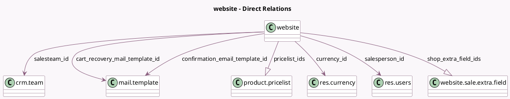

<!-- GENERATED:MODEL -->
---
tags: [odoo, community, generated, model]
---

# website

- Module: [[docs/Community Addons/website_sale/website_sale|website_sale]]
- Scope: Community Addons
- Defined in module: extension only
- Source files: `models/website.py`
- Python classes: `Website`

## Field footprint

- Detected fields: 33
- Field types: `Boolean` x 3, `Char` x 3, `Datetime` x 1, `Float` x 1, `Integer` x 3, `Many2one` x 5, `One2many` x 2, `Selection` x 15
- Relation fields: 7

## Sample fields

- `account_on_checkout`: `Selection`
- `add_to_cart_action`: `Selection`
- `auth_signup_uninvited`: `Selection`
- `cart_abandoned_delay`: `Float`
- `cart_recovery_mail_template_id`: `Many2one` (comodel `mail.template`)
- `confirmation_email_template_id`: `Many2one` (comodel `mail.template`)
- `contact_us_button_url`: `Char`
- `currency_id`: `Many2one` (comodel `res.currency`, compute `_compute_currency_id`)
- `ecommerce_access`: `Selection`
- `enabled_gmc_src`: `Boolean`
- `prevent_zero_price_sale`: `Boolean`
- `pricelist_ids`: `One2many` (comodel `product.pricelist`, compute `_compute_pricelist_ids`)
- `product_page_cols_order`: `Selection`
- `product_page_container`: `Selection`
- `product_page_grid_columns`: `Integer`
- `product_page_image_layout`: `Selection`
- `product_page_image_ratio`: `Selection`
- `product_page_image_ratio_mobile`: `Selection`
- `product_page_image_roundness`: `Selection`
- `product_page_image_spacing`: `Selection`

## Method hints

- Detected methods: 44
- Action methods: `action_dashboard_redirect`
- Compute methods: `_compute_currency_id`, `_compute_pricelist_ids`, `_compute_send_abandoned_cart_email_activation_time`, `_compute_show_line_subtotals_tax_selection`
- Onchange methods: none

## Direct relation diagram

## Navigation

- **Parent:** [[docs/Community Addons/website_sale/Models]]

<!-- GENERATED:MODEL -->
