<!-- GENERATED:MODEL -->
---
tags: [odoo, community, generated, model]
---

# website.sale.extra.field

- Module: [[docs/Community Addons/website_sale/website_sale|website_sale]]
- Scope: Community Addons
- Defined in module: yes
- Source files: `models/website_sale_extra_field.py`
- Python classes: `WebsiteSaleExtraField`
- Description: E-Commerce Extra Info Shown on product page

## Field footprint

- Detected fields: 5
- Field types: `Char` x 2, `Integer` x 1, `Many2one` x 2
- Relation fields: 2

## Sample fields

- `field_id`: `Many2one` (comodel `ir.model.fields`)
- `label`: `Char` (related `field_id.field_description`)
- `name`: `Char` (related `field_id.name`)
- `sequence`: `Integer`
- `website_id`: `Many2one` (comodel `website`)

## Method hints

- Detected methods: 0
- Action methods: none
- Compute methods: none
- Onchange methods: none

## Direct relation diagram

```plantuml
@startuml
!define ODOO_COLOR_PRIMARY #714B67
!define ODOO_COLOR_ACCENT #875A7B
!define ODOO_COLOR_BG #FAF7FA

skinparam backgroundColor ODOO_COLOR_BG
skinparam defaultTextAlignment left
skinparam ArrowColor ODOO_COLOR_ACCENT
skinparam ClassBackgroundColor white
skinparam ClassBorderColor ODOO_COLOR_PRIMARY
skinparam ComponentBackgroundColor white
skinparam ComponentBorderColor ODOO_COLOR_PRIMARY
skinparam NoteBackgroundColor #FFF8FF
skinparam NoteBorderColor ODOO_COLOR_ACCENT
skinparam SequenceLifeLineBorderColor ODOO_COLOR_ACCENT
skinparam SequenceLifeLineBackgroundColor #FFFFFF
skinparam SequenceParticipantBorderColor ODOO_COLOR_PRIMARY
skinparam SequenceParticipantBackgroundColor #FFFFFF
skinparam sequence {
  ArrowColor ODOO_COLOR_ACCENT
  ActorBorderColor ODOO_COLOR_PRIMARY
}
title website.sale.extra.field - Direct Relations
class "website.sale.extra.field" as website_sale_extra_field
class "ir.model.fields" as ir_model_fields
class "website" as website
website_sale_extra_field --> website : website_id
website_sale_extra_field --> ir_model_fields : field_id
@enduml
```

## Navigation

- **Parent:** [[docs/Community Addons/website_sale/Models]]

<!-- GENERATED:MODEL -->
