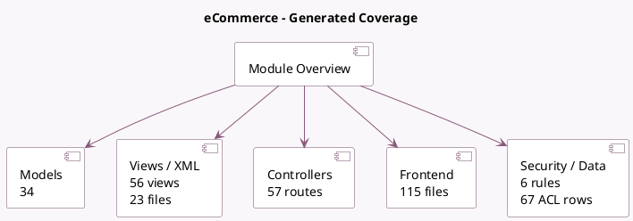

<!-- GENERATED:MODULE -->
---
tags: [odoo, community, module]
---

# eCommerce

- Scope: Community Addons
- Source: odoo/addons/website_sale
- Dependencies: [[docs/Community Addons/website/website|website]], [[docs/Community Addons/sale/sale|sale]], [[docs/Community Addons/website_payment/website_payment|website_payment]], [[docs/Community Addons/website_mail/website_mail|website_mail]], [[docs/Community Addons/portal_rating/portal_rating|portal_rating]], [[docs/Community Addons/digest/digest|digest]], [[docs/Community Addons/delivery/delivery|delivery]], [[docs/Community Addons/html_builder/html_builder|html_builder]]

## Summary

Sell your products online

## Generated coverage

- Models: 34
- XML files with UI/data artifacts: 23
- Views: 56
- Actions: 28
- Menus: 24
- Rules (ir.rule): 6
- Access CSV entries: 67
- Controller units: 11
- Frontend asset files: 115

## Module map

## Detail notes

- Models: [[docs/Community Addons/website_sale/Models|Models]] (34)
- Views and XML: [[docs/Community Addons/website_sale/Views|Views]] (23 files)
- Controllers: [[docs/Community Addons/website_sale/Controllers|Controllers]] (11)
- Frontend: [[docs/Community Addons/website_sale/Frontend|Frontend]] (115 files)

## Key models

- `account.move`
- `crm.team`
- `delivery.carrier`
- `digest.digest`
- `ir.http`
- `payment.token`
- `product.attribute`
- `product.document`
- `product.feed`
- `product.image`
- `product.pricelist`
- `product.pricelist.item`

## Navigation

- [[../Community Addons/Community Addons|Back to scope]]
- [[../../docs/docs|Back to docs]]

<!-- GENERATED:MODULE -->

## Curated analysis

### Functional role
- `website_sale` is the public commerce layer that turns products, prices, delivery methods, and payment-ready orders into a storefront experience.
- It is not just a website skin over `sale`; it adds website-specific pricing, checkout steps, product feeds, ribbons, visitor tracking, and cart/session behavior.

### Operational footprint
- The controller layer is broad: cart, checkout, delivery, payment, variant resolution, product configurator, reorder, and feeds each have their own entry point.
- The model layer extends both website and sales concepts, especially around `website.py`, `sale_order.py`, pricelists, and product presentation metadata.

### Frontend runtime shape
- The storefront is still anchored in QWeb templates and website pages, not in a single OWL root application.
- `website_sale/__manifest__.py` loads `static/src/interactions/**/*` into `web.assets_frontend`, which means public behavior is primarily attached through `@web/public/interaction`.
- OWL is used in focused pieces such as the image viewer dialog, notifications, builder options, and configurator screens, but those pieces enhance the storefront rather than replace its rendering model.
- For product-page changes, the default extension path is usually `views/templates.xml` plus the relevant public interaction or builder plugin, not a ground-up SPA rewrite.

### Telegram-validated guidance
- A public Odoo Developers thread raised the idea of rebuilding the product detail page entirely in OWL for Odoo 19.
- The current source tree supports a more precise conclusion: that approach is possible as custom architecture, but it is not how `website_sale` is designed out of the box.
- If SEO, multilingual rendering, snippets, and core storefront flows must remain stable, prefer extending the current QWeb + public interaction path before moving to a full OWL page shell.

### Evidence
- Source files: `odoo19/addons/website_sale/controllers/cart.py`, `odoo19/addons/website_sale/controllers/payment.py`, `odoo19/addons/website_sale/models/website.py`, `odoo19/addons/website_sale/models/sale_order.py`
- UI and frontend: `odoo19/addons/website_sale/views/templates.xml`, `odoo19/addons/website_sale/views/website_views.xml`, `odoo19/addons/website_sale/models/product_pricelist.py`
- Frontend runtime details: `odoo19/addons/website_sale/static/src/interactions/website_sale.js`, `odoo19/addons/website_sale/static/src/js/components/website_sale_image_viewer.js`, `odoo19/addons/website_sale/static/src/js/notification/notification_service.js`
- Tests: `odoo19/addons/website_sale/tests/test_address.py`, `odoo19/addons/website_sale/tests/test_website_sale_pricelist.py`, `odoo19/addons/website_sale/tests/test_website_sale_product_configurator.py`

### Related notes
- `[[docs/Community Addons/sale_management/sale_management|sale_management]]`
- `[[docs/Community Addons/website/website|website]]`
- `[[docs/Core/Framework/web]]`

### Risks and follow-up
- Anonymous sessions, multi-company pricelists, taxes, and delivery costs interact in checkout, so storefront bugs often trace back to configuration rather than controller code alone.
- Product configurator and pricing behavior should always be tested with the same website, fiscal position, and visitor state that production users will actually have.
- Legacy comparison backlog was retired on 2026-03-02; keep this note focused on the current codebase.

