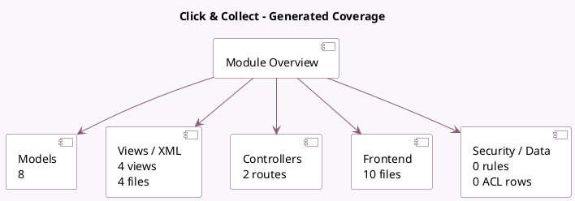

<!-- GENERATED:MODULE -->
---
tags: [odoo, community, module]
---

# Click & Collect

- Scope: Community Addons
- Source: odoo/addons/website_sale_collect
- Dependencies: [[docs/Community Addons/base_geolocalize/base_geolocalize|base_geolocalize]], [[docs/Community Addons/payment_custom/payment_custom|payment_custom]], [[docs/Community Addons/website_sale_stock/website_sale_stock|website_sale_stock]]

## Generated coverage

- Models: 8
- XML files with UI/data artifacts: 4
- Views: 4
- Actions: 0
- Menus: 0
- Rules (ir.rule): 0
- Access CSV entries: 0
- Controller units: 1
- Frontend asset files: 10

## Module map

## Detail notes

- Models: [[docs/Community Addons/website_sale_collect/Models|Models]] (8)
- Views and XML: [[docs/Community Addons/website_sale_collect/Views|Views]] (4 files)
- Controllers: [[docs/Community Addons/website_sale_collect/Controllers|Controllers]] (1)
- Frontend: [[docs/Community Addons/website_sale_collect/Frontend|Frontend]] (10 files)

## Key models

- `delivery.carrier`
- `payment.provider`
- `payment.transaction`
- `product.template`
- `res.config.settings`
- `sale.order`
- `stock.warehouse`
- `website`

## Navigation

- [[../Community Addons/Community Addons|Back to scope]]
- [[../../docs/docs|Back to docs]]

<!-- GENERATED:MODULE -->

