<!-- GENERATED:MODEL -->
---
tags: [odoo, community, generated, model]
---

# product.attribute.category

- Module: [[docs/Community Addons/website_sale_comparison/website_sale_comparison|website_sale_comparison]]
- Scope: Community Addons
- Defined in module: yes
- Source files: `models/product_attribute_category.py`
- Python classes: `ProductAttributeCategory`
- Description: Product Attribute Category

## Field footprint

- Detected fields: 3
- Field types: `Char` x 1, `Integer` x 1, `One2many` x 1
- Relation fields: 1

## Sample fields

- `attribute_ids`: `One2many` (comodel `product.attribute`)
- `name`: `Char` (comodel `Category Name`)
- `sequence`: `Integer` (comodel `Sequence`)

## Method hints

- Detected methods: 0
- Action methods: none
- Compute methods: none
- Onchange methods: none

## Direct relation diagram

```plantuml
@startuml
!define ODOO_COLOR_PRIMARY #714B67
!define ODOO_COLOR_ACCENT #875A7B
!define ODOO_COLOR_BG #FAF7FA

skinparam backgroundColor ODOO_COLOR_BG
skinparam defaultTextAlignment left
skinparam ArrowColor ODOO_COLOR_ACCENT
skinparam ClassBackgroundColor white
skinparam ClassBorderColor ODOO_COLOR_PRIMARY
skinparam ComponentBackgroundColor white
skinparam ComponentBorderColor ODOO_COLOR_PRIMARY
skinparam NoteBackgroundColor #FFF8FF
skinparam NoteBorderColor ODOO_COLOR_ACCENT
skinparam SequenceLifeLineBorderColor ODOO_COLOR_ACCENT
skinparam SequenceLifeLineBackgroundColor #FFFFFF
skinparam SequenceParticipantBorderColor ODOO_COLOR_PRIMARY
skinparam SequenceParticipantBackgroundColor #FFFFFF
skinparam sequence {
  ArrowColor ODOO_COLOR_ACCENT
  ActorBorderColor ODOO_COLOR_PRIMARY
}
title product.attribute.category - Direct Relations
class "product.attribute.category" as product_attribute_category
class "product.attribute" as product_attribute
product_attribute_category --|> product_attribute : attribute_ids
@enduml
```

## Navigation

- **Parent:** [[docs/Community Addons/website_sale_comparison/Models]]

<!-- GENERATED:MODEL -->
