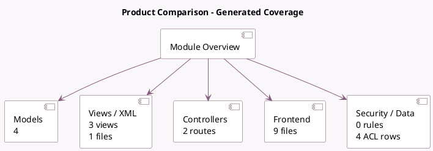

<!-- GENERATED:MODULE -->
---
tags: [odoo, community, module]
---

# Product Comparison

- Scope: Community Addons
- Source: odoo/addons/website_sale_comparison
- Dependencies: [[docs/Community Addons/website_sale/website_sale|website_sale]]

## Summary

Allow shoppers to compare products based on their attributes

## Generated coverage

- Models: 4
- XML files with UI/data artifacts: 1
- Views: 3
- Actions: 1
- Menus: 1
- Rules (ir.rule): 0
- Access CSV entries: 4
- Controller units: 1
- Frontend asset files: 9

## Module map

## Detail notes

- Models: [[docs/Community Addons/website_sale_comparison/Models|Models]] (4)
- Views and XML: [[docs/Community Addons/website_sale_comparison/Views|Views]] (1 files)
- Controllers: [[docs/Community Addons/website_sale_comparison/Controllers|Controllers]] (1)
- Frontend: [[docs/Community Addons/website_sale_comparison/Frontend|Frontend]] (9 files)

## Key models

- `product.attribute`
- `product.attribute.category`
- `product.product`
- `product.template.attribute.line`

## Navigation

- [[../Community Addons/Community Addons|Back to scope]]
- [[../../docs/docs|Back to docs]]

<!-- GENERATED:MODULE -->

