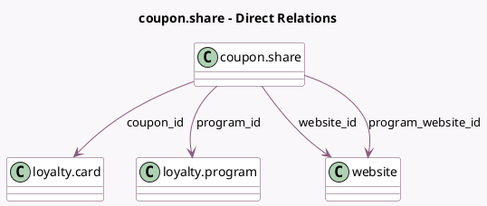

<!-- GENERATED:MODEL -->
---
tags: [odoo, community, generated, model]
---

# coupon.share

- Module: [[docs/Community Addons/website_sale_loyalty/website_sale_loyalty|website_sale_loyalty]]
- Scope: Community Addons
- Defined in module: yes
- Source files: `wizard/coupon_share.py`
- Python classes: `CouponShare`
- Description: Create links that apply a coupon and redirect to a specific page

## Field footprint

- Detected fields: 7
- Field types: `Char` x 3, `Many2one` x 4
- Relation fields: 4

## Sample fields

- `coupon_id`: `Many2one` (comodel `loyalty.card`)
- `program_id`: `Many2one` (comodel `loyalty.program`)
- `program_website_id`: `Many2one` (comodel `website`, related `program_id.website_id`)
- `promo_code`: `Char` (compute `_compute_promo_code`)
- `redirect`: `Char`
- `share_link`: `Char` (compute `_compute_share_link`)
- `website_id`: `Many2one` (comodel `website`)

## Method hints

- Detected methods: 7
- Action methods: `action_generate_short_link`
- Compute methods: `_compute_promo_code`, `_compute_share_link`
- Onchange methods: none

## Direct relation diagram

## Navigation

- **Parent:** [[docs/Community Addons/website_sale_loyalty/Models]]

<!-- GENERATED:MODEL -->
