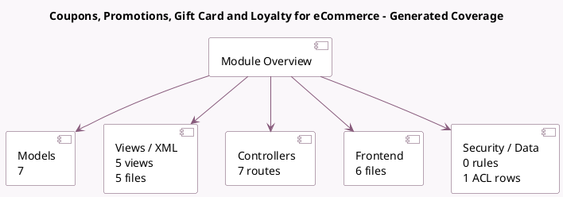

<!-- GENERATED:MODULE -->
---
tags: [odoo, community, module]
---

# Coupons, Promotions, Gift Card and Loyalty for eCommerce

- Scope: Community Addons
- Source: odoo/addons/website_sale_loyalty
- Dependencies: [[docs/Community Addons/website_sale/website_sale|website_sale]], [[docs/Community Addons/website_links/website_links|website_links]], [[docs/Community Addons/sale_loyalty/sale_loyalty|sale_loyalty]]

## Summary

Use coupon, promotion, gift cards and loyalty programs in your eCommerce store

## Generated coverage

- Models: 7
- XML files with UI/data artifacts: 5
- Views: 5
- Actions: 0
- Menus: 3
- Rules (ir.rule): 0
- Access CSV entries: 1
- Controller units: 4
- Frontend asset files: 6

## Module map

## Detail notes

- Models: [[docs/Community Addons/website_sale_loyalty/Models|Models]] (7)
- Views and XML: [[docs/Community Addons/website_sale_loyalty/Views|Views]] (5 files)
- Controllers: [[docs/Community Addons/website_sale_loyalty/Controllers|Controllers]] (4)
- Frontend: [[docs/Community Addons/website_sale_loyalty/Frontend|Frontend]] (6 files)

## Key models

- `coupon.share`
- `loyalty.card`
- `loyalty.program`
- `loyalty.rule`
- `product.product`
- `sale.order`
- `sale.order.line`

## Navigation

- [[../Community Addons/Community Addons|Back to scope]]
- [[../../docs/docs|Back to docs]]

<!-- GENERATED:MODULE -->

